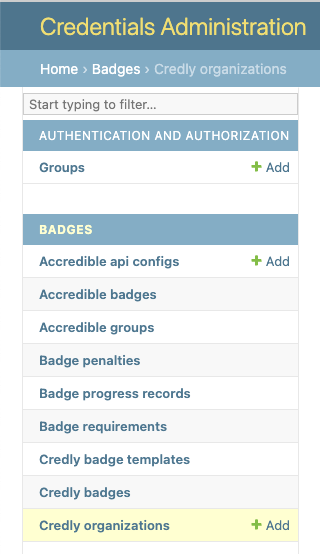
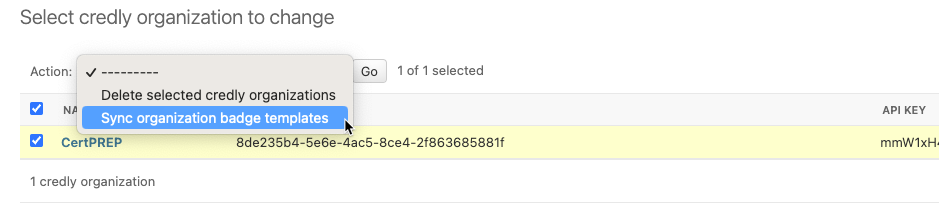
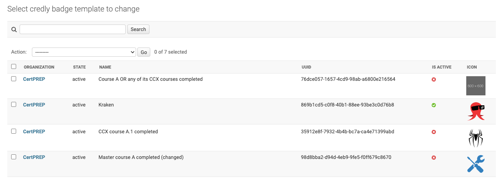
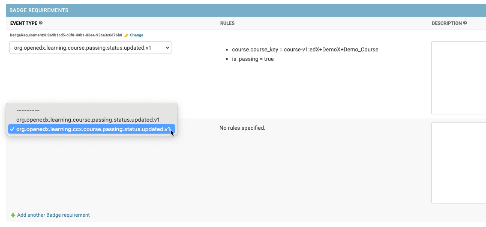
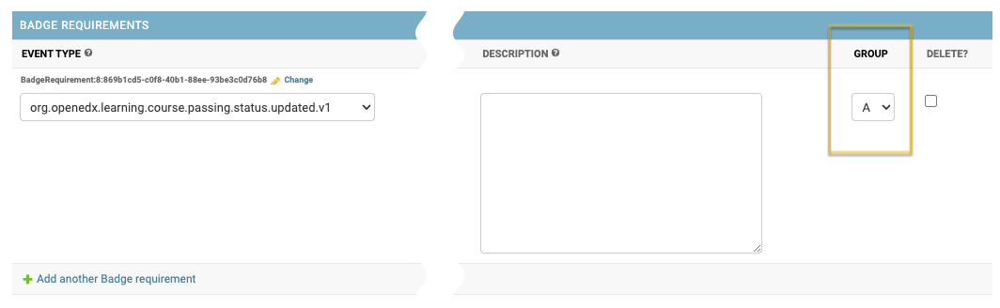
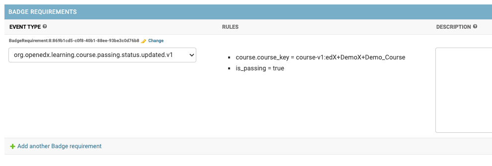
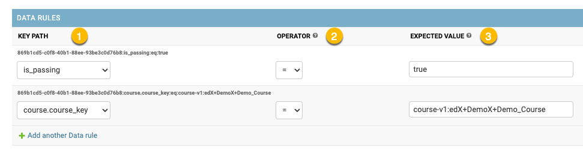
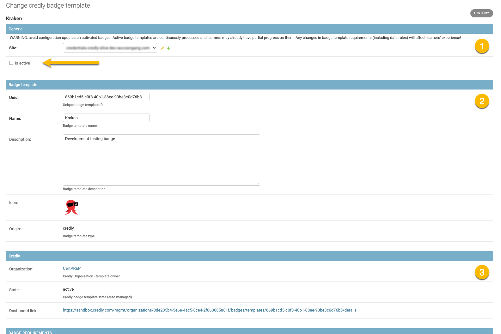

Configuration
=============

.. note::

    This section provides information on how and where to set up badge templates and organizations.

The Badges feature is configured in the Credentials admin panel.

Credly Organizations
--------------------

Multiple Credly Organizations can be configured.

**All communication between Open edX Credentials and Credly service happens on behalf of a Credly Organization.**

Go to the Credly Organization section in the admin panel and create a new item:

1. to set the UUID use your Credly Organization identifier;
2. to set the authorization token, used to sync the Credly Organization.

Check: the system pulls the Organization's details and updates its name.

In case of errors, check the credentials used for the Organization

Badge templates
---------------

*Credly badge templates* (badge templates for short) are created in the Credly Organization's dashboard and then, if published, they are retrieved by the Credentials via API.

Webhooks
~~~~~~~~~~~~~~~

.. note::

    Webhooks is a connection with Credly and external platform that allows your server to be notified about events occuring within Credly.

Webhooks are set up on Credly management dashboard as Credly is a main initiator of the syncronization.

You should be able to select an action from the list so that whenever the specified action occurs internally, the external system is alerted.

Without this synchronization, the external system will not be notified of any significant changes (e.g. a badge template update, or a badge template has been archived) and may incorrectly issue erroneous or outdated badges.

Synchronization
~~~~~~~~~~~~~~~

To synchronize Credly badge templates for the Organization one should:

- navigate "Credly badge templates" list page;
- select the Organization;
- use ``Sync organization badge templates`` action;

On success, the system will update the list of Credly badge templates for the Organization:

- only badge templates with ``active`` state are pulled;
- Credly badge template records are created inactive (disabled);

For a badge template to be considered during the processing it must be configured (to have at least 1 requirement) and activated (enabled) first.

Badge Requirements
------------------

    Requirements describe **what** and **how** must happen on the system to earn a badge.

Badge Requirement(s) specification is a crucial part of badge template configuration.
At least one badge requirement must be associated with a badge template.

Badge Requirements are listed inline on a badge template detail page.

A badge template can have multiple requirements. All badge requirements must be *fulfilled* before the system will issue a badge to a learner.

Event type
~~~~~~~~~~

    Describes **what is expected to happen**.

Available event type subset is pre-configured in the application settings.

.. note::

    Technically, any public signal from the `openedx-events`_ library can be used for badge template requirements setup, if it includes user PII (UserData), so users can be identified.

Rules
~~~~~

A list of configured data rules (if any), see "Data Rules".

Description
~~~~~~~~~~~

**Description** is an optional human-readable reminder that describes what the requirement is about.

    Badge Requirement can be **deeper specified** via its Data Rules.

Group
~~~~~

Optional configuration (by default each badge requirement is assigned a separate Group).

Allows putting 2 or more badge requirements as a Group.
Requirements group is fulfilled if any of its requirements is fulfilled.

    "OR" logic is applied inside a Group.

See `configuration examples`_.

Data Rules
----------

    Describes **how it is expected to happen**

Data Rules detail their parent Badge Requirement based on the expected event payload.

To edit/update a Data Rule:

- navigate to the Badge Requirement detail page (use ``Change`` inline link);
- find the "Data Rules" section and add a new item;

**Each data rule describes a single expected payload value:**

All key paths are generated based on the event type specified for the parent Badge Requirement.

1. **Key path** - payload path to the target attribute
    - dot-separated string;
    - each event type has its unique pre-defined set of key paths;
2. **Operator** - comparison operation to apply between expected and actual values;
    - available operators: (payload)
        -  ``"="`` (equals);
        - ``"!="`` (not equals);
3. **Expected value** - an expected value for the target attribute
    - payload boolean positive values allowed: ``"true", "True", "yes", "Yes", "+"``;
    - payload boolean negative values allowed: ``"false", "False", "no", "No", "-"``;

Please, see `configuration examples`_ for clarity.

Badge Penalties
---------------

    Penalties allow badge progress resetting based on user activity.

Badge penalties are optional.
There could be 0 or more badge penalties configured for a badge template.

Each badge penalty is *targeted* to 1 or more badge requirements.
A penalty setup is similar to a badge requirement, but has different effect: it decreases badge progress for a user.

When all penalty rules have been applied, a learner's progress towards a badge is reset.

.. image:: ../_static/images/badges/badges-admin-penalty-rules.png
        :alt: Badge penalty rules edit

Activation
----------

Configured badge template can be activated:

- navigate to the badge template detail page;
- check ``Is active`` checkbox;

    Activated badge template starts "working" immediately.

Credly badge template record includes:

1. Core credential attributes;
2. Badge template credential attributes;
3. Credly service attributes (state, dashboard link);
4. Configured requirements;

.. _`configuration examples`: examples.html
.. _openedx-events: https://github.com/openedx/openedx-events