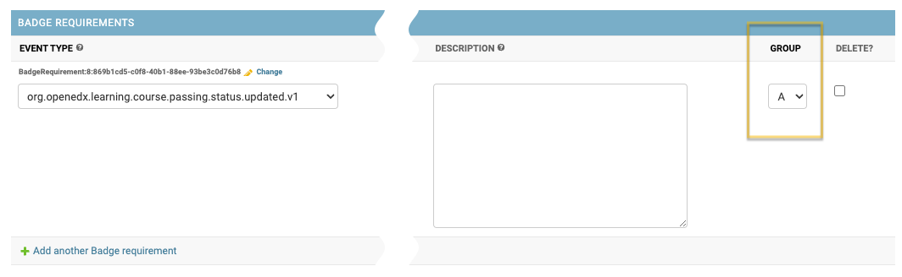
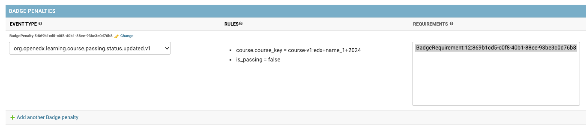

Accredible Configuration
========================

.. note::

    This section provides information on how and where to set up accredible badge groups and configuration.

The Badges feature is configured in the Credentials admin panel.

.. image:: ../../_static/images/badges/badges-admin.png
        :alt: Badges administration

Accredible API Configurations
-----------------------------

Multiple Accredible API Configurations can be configured.

**All communication between Open edX Credentials and Accredible service happens on behalf of a Accredible API config.**

Go to the Accredible API Configs section in the admin panel and create a new item:

1. to set the name for config;
2. to set the api key, used to sync the Accredible account.

In case of errors, check the credentials used for the API Config

Groups
---------------

*Accredible groups* (badge templates for short) are created in the Accredible dashboard and then, they are retrieved by the Credentials via API.

Synchronization
~~~~~~~~~~~~~~~

To synchronize Accredible groups for the API Configuration one should:

- navigate "Accredible API Configs" list page;
- select the API Config;
- use ``Sync groups`` action;

On success, the system will update the list of Accredible groups:

- Accredible group records are created inactive (disabled);

For a group to be considered during the processing it must be configured (to have at least 1 requirement) and activated (enabled) first.

Badge Requirements
------------------

    Requirements describe **what** and **how** must happen on the system to earn a badge.

Badge Requirement(s) specification is a crucial part of group configuration.
At least one badge requirement must be associated with a group.

Badge Requirements are listed inline on a group detail page.

.. image:: ../../_static/images/badges/badges-admin-template-requirements.png
        :alt: Credly badge template requirements

A badge template can have multiple requirements. All badge requirements must be *fulfilled* before the system will issue a badge to a learner.

Event type
~~~~~~~~~~

    Describes **what is expected to happen**.

Available event type subset is pre-configured in the application settings.

.. note::

    Technically, any public signal from the `openedx-events`_ library can be used for badge template requirements setup, if it includes user PII (UserData), so users can be identified.

Rules
~~~~~

A list of configured data rules (if any), see "Data Rules".

Description
~~~~~~~~~~~

**Description** is an optional human-readable reminder that describes what the requirement is about.

    Badge Requirement can be **deeper specified** via its Data Rules.

Group
~~~~~

Optional configuration (by default each badge requirement is assigned a separate Group).

Allows putting 2 or more badge requirements as a Group.
Requirements group is fulfilled if any of its requirements is fulfilled.

    "OR" logic is applied inside a Group.

See :ref:`Configuration examples for Badging`.

Data Rules
----------

    Describes **how it is expected to happen**

Data Rules detail their parent Badge Requirement based on the expected event payload.

To edit/update a Data Rule:

- navigate to the Badge Requirement detail page (use ``Change`` inline link);
- find the "Data Rules" section and add a new item;

.. image:: ../../_static/images/badges/badges-admin-requirement-rules.png
        :alt: Badge requirement rules edit

**Each data rule describes a single expected payload value:**

All key paths are generated based on the event type specified for the parent Badge Requirement.

.. image:: ../../_static/images/badges/badges-admin-data-rules.png
        :alt: Badge requirement data rules

1. **Key path** - payload path to the target attribute
    - dot-separated string;
    - each event type has its unique pre-defined set of key paths;
2. **Operator** - comparison operation to apply between expected and actual values;
    - available operators: (payload)
        -  ``"="`` (equals);
        - ``"!="`` (not equals);
3. **Expected value** - an expected value for the target attribute
    - payload boolean positive values allowed: ``"true", "True", "yes", "Yes", "+"``;
    - payload boolean negative values allowed: ``"false", "False", "no", "No", "-"``;

Please, see :ref:`Configuration examples for Badging` for clarity.

Badge Penalties
---------------

    Penalties allow badge progress resetting based on user activity.

Badge penalties are optional.
There could be 0 or more badge penalties configured for a badge template.

Each badge penalty is *targeted* to 1 or more badge requirements.
A penalty setup is similar to a badge requirement, but has different effect: it decreases badge progress for a user.

When all penalty rules have been applied, a learner's progress towards a badge is reset.

Activation
----------

Configured group can be activated:

- navigate to the group detail page;
- check ``Is active`` checkbox;

    Activated groups starts "working" immediately.

Accredible group record includes:

1. Core credential attributes;
2. Badge template credential attributes;
3. Accredible service attributes (dashboard link);
4. Configured requirements;

.. _openedx-events: https://github.com/openedx/openedx-events