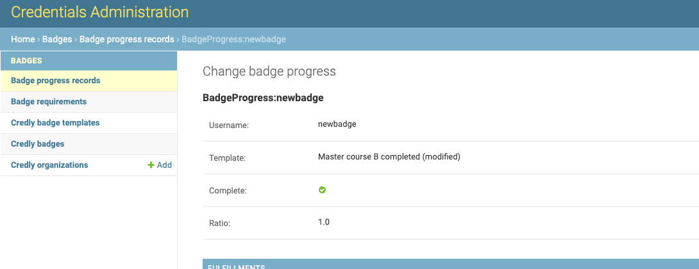
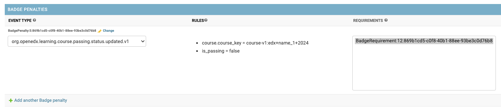

Processing
==========

Incoming events async processing happens in a separate event bus consumer process(es).
See the Event Bus documentation for details.

Events subscription
-------------------

.. note::

    Only explicitly configured `event types`_ take part in the processing.

See Badges `default settings`_ for the default set of supported events.
Though, it is expected that any public signal from the `openedx-events`_ library can extend this set with a single requirement: its payload includes a learner PII (UserData object).

Learner identification
----------------------

.. note::

    Each incoming event must be associated with a specific learner.

The system tries to identify a learner by the `UserData` object in the event payload.
If the learner is not found, the event is ignored.

The system also ensures that such learner exists in the Credentials (creates if needed).

Requirements analysis
---------------------

Since any requirement is associated with a single event type, all relevant requirements are collected for the incoming signal:

1. appropriate event type;
2. active badge templates;

Each requirement's rules are checked against the event payload.
Requirement processing is dropped as soon as the system recognizes not applying rules.

Progress update
---------------

Current learners' badge progress is stored in the ``Badge Progress`` record.

.. note::

    Since badge templates can have more than one requirement, the system should track intermediate progresses as well.

Once all rules of the processed requirement apply, the system:

1. ensures there is the badge progress record for the learner;
2. marks the requirement as fulfilled for the learner;

If a Badge Progress is recognized as completed (all requirements for the badge template are fulfilled), the system initiates the awarding process.

Badge awarding
--------------

.. note::

    Once all requirements for the badge template are fulfilled, the system should award the badge.

On badge progress completion, the system:

1. creates an *internal* user credential record for the learner;
2. notifies (public signal) about new badge awarded;
3. tries to issue an *external* Credly badge for the learner;

.. note::

    The Badges application implements its extended ``UserCredential`` version (the CredlyBadge) to track external issuing state. Once the Credly badge is successfully issued the **CredlyBadge is updated with its UUID and state**.

.. _event types: https://docs.openedx.org/projects/openedx-events/en/latest/
.. _openedx-events: https://github.com/openedx/openedx-events
.. _default settings: settings.html#default-settings

Badge revocation
----------------

Badges can also be revoked. Its a separete set of rules that need to be set up.

1. Go to Badge Penalties section in admin panel (admin/badges/badge_pentalties).

2. Select a certain requirement that was previously set up to link penalty
    a. To know how to set up badge template requirements, go to the `Configuration`_ section.

3. Note that all penalties have to be linked to a certain requirement, so that when that requirement is not fulfilled, system would know when to revoke the badge.

.. _Configuration: configuration.html

When a learner's badge is revoked by Credly, the Credentials IDA will be notified and will update it's internal records. The status of the badge will change from `awarded` to `revoked` upon successful revocation.

The badge cannot be reissued once it has been revoked.
