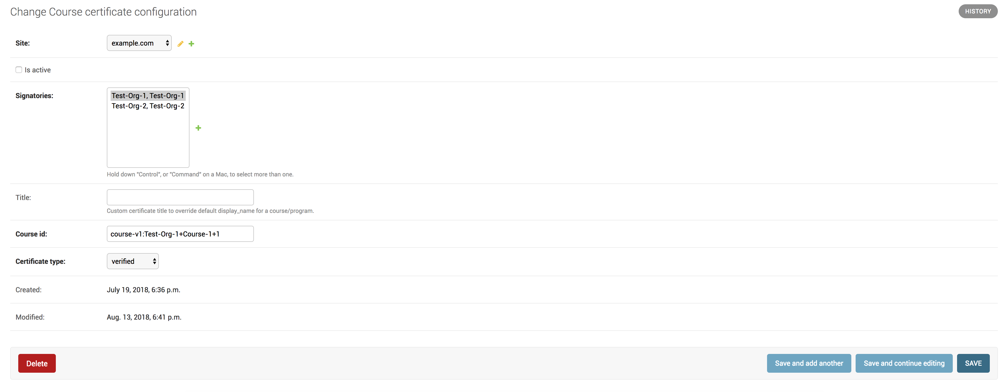
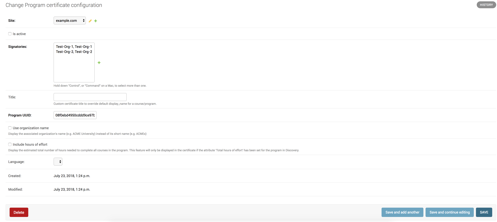
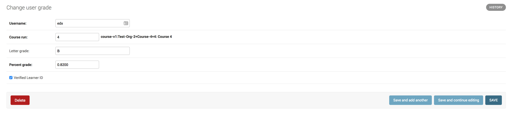

Credentials Administration
==========================

Site Configuration
------------------

This functionality allows you to configure a custom site.
To add this functionality, edX has extended the `Django sites framework <https://docs.djangoproject.com/en/1.8/ref/contrib/sites/>`_.
The Django sites framework allows you to map domains to a **Site** object, which consists of an ID and a name.

You must make sure that there is only one configuration per site.

Site Configuration Model
~~~~~~~~~~~~~~~~~~~~~~~~

To add or update a custom site's configurations, including the basic theming, use the ``SiteConfiguration`` model.

The following image shows some of the fields in the ``SiteConfiguration`` model in the Django administration panel
for a configured site.

.. image:: _static/images/site_configuration.png
    :width: 600px
    :alt: Populated site configuration model

Each site can have only one configuration.

Add Another Site and Site Configuration
~~~~~~~~~~~~~~~~~~~~~~~~~~~~~~~~~~~~~~~

If you want to add additional sites, you can use the ``create_or_update_site`` management command. Run
``./manage.py create_or_update_site --help`` to view all of the parameters.

Signatory Configuration
-----------------------

This configuration adds certificate signatories.
This configuration is required. Every certificate must include at least one signatory.

Signatory Configuration Model
~~~~~~~~~~~~~~~~~~~~~~~~~~~~~

To add or update a signatory's configuration, use the ``Signatory`` model.

The following image shows the ``Signatory`` model in the Django administration panel for a configured signatory.

.. image:: _static/images/signatory.png
    :width: 600px
    :alt: Populated signatory model

Course Certificate Configuration
--------------------------------

This configuration adds course certificates.
This configuration creates a new **CourseCertificate** object that is used to award course certificates to learners.

Course Certificate Configuration Model
~~~~~~~~~~~~~~~~~~~~~~~~~~~~~~~~~~~~~~

To add or update a course certificate's configuration, use the ``CourseCertificate`` model.

The following image shows the ``CourseCertificate`` model in the Django administration panel for a configured course certificate.

The ``CourseCertificate`` model has a **unique together** constraint on the **Site**, **Course ID** and **Certificate type** fields.
In this model, the same site, course ID, and certificate type cannot have more than one entry.

Program Certificate Configuration
---------------------------------

This configuration adds program certificates.
This configuration creates a new **ProgramCertificate** object that is used to award program certificates to learners.

Program Certificate Configuration Model
~~~~~~~~~~~~~~~~~~~~~~~~~~~~~~~~~~~~~~~

To add or update a program certificate's configuration, use the ``ProgramCertificate`` model.

The following image shows the ``ProgramCertificate`` model in the Django administration panel for a configured program certificate.

If `Use organization name` is checked then organization full name will be displayed on the certificate else short name
will be displayed.

User Credentials Model
~~~~~~~~~~~~~~~~~~~~~~

Record of a user's completion of certain learning material, at a certain point in time. 

To add or update a user credential, use the ``UserCredential`` model.

The following image shows the ``UserCredential`` model in the Django administration panel for a configured user
credential.

.. image:: _static/images/user_credential.png
    :width: 600px
    :alt: Configured user credential model

User credentials may  contain arbitrary user-defined name/value attribute pairs related to the context in which
they were awarded. At this time, the only name/value pair that we watch is "visible_date" holding a date string
value.
Credentials may also be assigned a “revoked” status, which essentially implements soft-deletion
(credentials/certificates are no longer publicly accessible, but the stored data is retained).

Records
-------

This functionality adds student records, along with the grades and pathways associated with a record.  

Shared Program Records
~~~~~~~~~~~~~~~~~~~~~~

To add or update a shared program record, use the ``ProgramCertRecord`` model.  This model is used to track
publicly shared records. To manually unshare a public record, you can delete an entry in this table.

The following image shows a configured ``ProgramCertRecord`` model in the Django administration panel.

User Credit Pathways
~~~~~~~~~~~~~~~~~~~~

To add or update a user credit pathway, use the ``UserCreditPathway`` model. This model is used to track which
users have sent which records to which credit pathways.

The following image shows a configured ``UserCreditPathway`` model in the Django administration panel.

User Grades
~~~~~~~~~~~

To add or update user grades, use the ``UserGrade`` model. This model is used to track the highest grade a user
has earned for a record. Grades are added from the LMS whenever a grade is updated there.

The following image shows a configured ``UserGrade`` model in the Django administration panel.

Social Django
-------------

This service uses social django for authentication. For information on
setting this up, see the getting started documentation.
