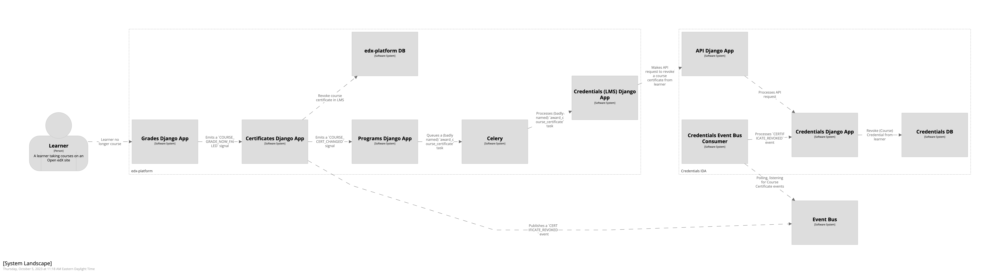
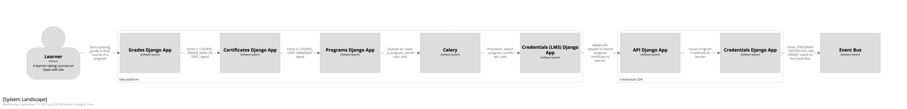

Event Bus
=========

The Credentials IDA supports the use of the Open edX Event Bus to consume and publish asynchronous `Open edX Events`_.

For more information on how to start using the Event Bus in your environment, see the `How to start using the Event Bus`_ doc in the Open edX Confluence and the `Event Bus how-to docs in GitHub`_.

Events Consumed
~~~~~~~~~~~~~~~

Before Credentials can consume these events, you must:

* Have the appropriate configuration enabled for the LMS to publish course certificate events to the Event Bus:

  * for ``CERTIFICATE_CREATED`` events, you must have the ``SEND_CERTIFICATE_CREATED_SIGNAL`` setting enabled in your LMS configuration
  * for ``CERTIFICATE_REVOKED`` events, you must have the ``SEND_CERTIFICATE_REVOKED_SIGNAL`` setting enabled in your LMS configuration

* Have the ``EVENT_BUS_REDIS_CONSUMERS_ENABLED`` or the ``EVENT_BUS_KAFKA_CONSUMERS_ENABLED`` setting enabled in your Credentials configuration, depending on the underlying Event Bus implementation used in your Open edX environment.

There is additional configuration required to run the Event Bus in an Open edX environment, this configuration is beyond the scope of this document. Please see `How to start using the Event Bus`_ for more information.

CERTIFICATE_CREATED
-------------------

The Credentials IDA supports consuming ``CERTIFICATE_CREATED`` events published by the LMS of ``edx-platform``. If configured, this event is fired by the LMS when a (course) certificate is awarded to a learner. Upon successful processing of this event, a (course) credential is created for the learner in Credentials.

.. image:: _static/images/course_certificate_awarded.png
    :alt: A diagram showing how a course credential is awarded to a learner and how the data moves between the monolith and the Credentials IDA. A textual rendition is availalable in JSON in the document course_certificate_awarded.dsl, also in this repository.

CERTIFICATE_REVOKED
-------------------

The Credentials IDA supports consuming ``CERTIFICATE_REVOKED`` events published by the LMS of ``edx-platform``. If configured, this event is fired by the LMS when a (course) certificate is revoked from a learner. Upon successful processing of this event, a (course) credential will be revoked from the learner in Credentials.

Events Published
~~~~~~~~~~~~~~~~

The Credentials IDA supports publishing events to the Event Bus when a (program) credential is awarded or revoked from a learner.

PROGRAM_CERTIFICATE_AWARDED
---------------------------

To publish an event to the Event Bus when a program credential is awarded to a learner, you must enable the ``SEND_PROGRAM_CERTIFICATE_AWARDED_SIGNAL`` in the Credentials IDA's configuration.

PROGRAM_CERTIFICATE_REVOKED
---------------------------

To publish an event to the Event Bus when a program credential is revoked from a learner, you must enable the ``SEND_PROGRAM_CERTIFICATE_REVOKED_SIGNAL`` in the Credentials IDA's configuration.

.. _Open edX Events: https://github.com/openedx/openedx-events
.. _How to start using the Event Bus: https://openedx.atlassian.net/wiki/spaces/AC/pages/3508699151/How+to+start+using+the+Event+Bus?focusedCommentId=3571417100
.. _Event Bus how-to docs in GitHub: https://github.com/openedx/openedx-events/tree/main/docs/how-tos
