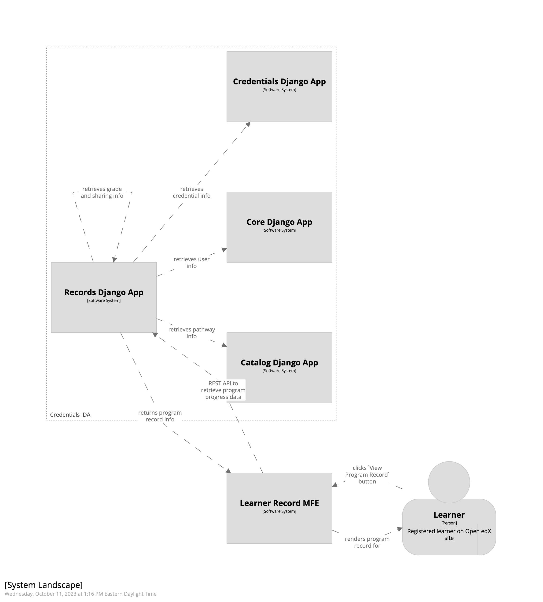
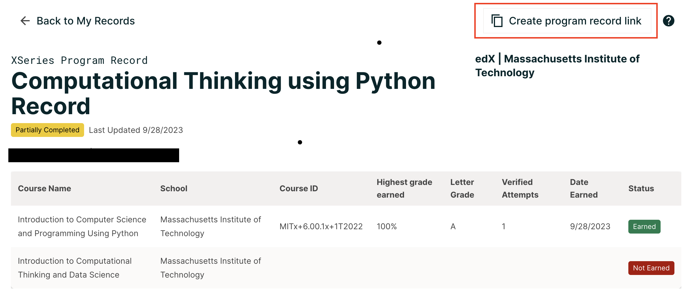
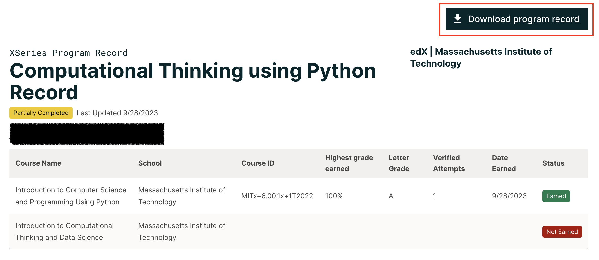
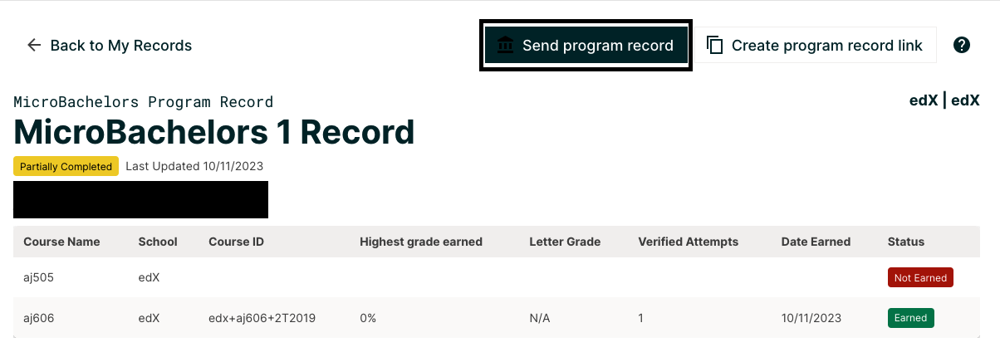

Learner Records
===============

The Credentials IDA keeps track of learners' progress through their courses and programs. A learner can view and share
their achievements in a program, called a ``Program Record``, through the `Learner Record Microfrontend`_ (MFE).

The Learner Record MFE must be configured and deployed independently from the Credentials IDA.

A learner *must* be logged in to view their program records, they can navigate to their program records from one of
two places:

- By clicking the ``View My Records`` button from their LMS Profile page, OR
- By clicking the ``View Program Record`` button from their LMS Program Dashboard page.

Initially, when a learner visits the Learner Record MFE, the learner will see a list of all programs they are enrolled
in. If desired, a learner can then retrieve their certificate and grade data for each program they are enrolled in.

Below are a few high level diagrams showing how data is retrieved for rendering a learner's program records.

Rendering a learner's list of enrolled programs:

.. image:: _static/images/learner_record_mfe_diagram.png
    :alt: A diagram showing how data is retrieved to render a learner's Learner Record. A textual rendition is available in JSON in the document learner_record_mfe.dsl, also in this repository.

Rendering a learner's program record:

Caveat: If a learner has earned a certificate that is *not* associated with a Program, it will not be shown as part of
the learner's Learner Record.

Configuration
-------------

Syncing Catalog Data
^^^^^^^^^^^^^^^^^^^^

In order for Credentials (and thus the Learner Record MFE) to display program, course, and pathway information to
learners, the system must ingest data from the Catalog (`Course Discovery`_) IDA.

This catalog data is ingested through use of the `Copy Catalog`_ management command. This command must be run
periodically to keep the catalog data fresh in the Credentials database.

Enabling Program Records
^^^^^^^^^^^^^^^^^^^^^^^^

Program Record support is enabled by default. Optionally, an Administrator may disable support for the program record
feature by disabling the ``Enable Learner Records`` checkbox in your site's ``Site Configuration`` (via Django Admin).

Creation
--------

Program Records don't have a concrete representation in the Credentials database.

The Credentials IDA receives certificate and grade data from the LMS as learners' progress and complete their courses.
When a learner accesses the records of a specific program, their certificate and grade data is retrieved from the
Credentials IDA's records and displayed.

Backpopulation
^^^^^^^^^^^^^^

If, for any reason, you need to backpopulate certificate or grade data in Credentials, you can run the
`Notify Credentials`_ (LMS) management command.

Sharing
-------

The Learner Record MFE supports the ability for a learner to share their program progress. When a learner click the
``Create program record link`` button, a public version of the program record page is created. Anyone with that link can
view it, without needing to be logged in (or requiring an account).

In addition, the public program record page includes a ``Download program record`` button that downloads a CSV version
of the learner's progress in their program.

Currently, there is no user management of the shared record. If a learner wants to stop sharing a public program
record, an admin must delete the record's entry via Django Admin (through the ``ProgramCertRecord`` model).

Sharing For Credit
^^^^^^^^^^^^^^^^^^

A learner can also choose to send a program record to a site partner, to receive credit from that partner for the
certificates they have earned. This is referred to as a ``Credit Pathway``.

When a learner shares their program progress through a pathway (by clicking the ``Share program record`` button), an
email is sent to the selected partner with a link to the Learner's public program record page. If a public version of
the program record does not exist at this time, one is created.

Each partner will have their own process for initiating or processing a credit request and is beyond the scope of this
document.

Read the `Pathways`_ documentation for more information on how to enable and configure credit requesting
credit.

If no credit pathways are enabled for a given program, the ``Send Learner Record`` button will not appear on the
learner's program record page.

.. _Learner Record Microfrontend: https://github.com/openedx/frontend-app-learner-record
.. _Course Discovery: https://github.com/openedx/course-discovery
.. _Copy Catalog: https://github.com/openedx/credentials/blob/master/credentials/apps/catalog/management/commands/copy_catalog.py
.. _Notify Credentials: https://github.com/openedx/edx-platform/blob/master/openedx/core/djangoapps/credentials/management/commands/notify_credentials.py
.. _Pathways: https://github.com/openedx/credentials/blob/master/docs/pathways.rst
