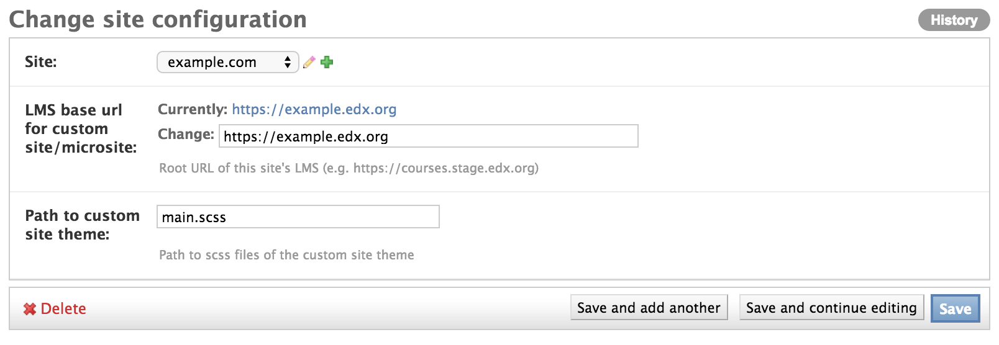
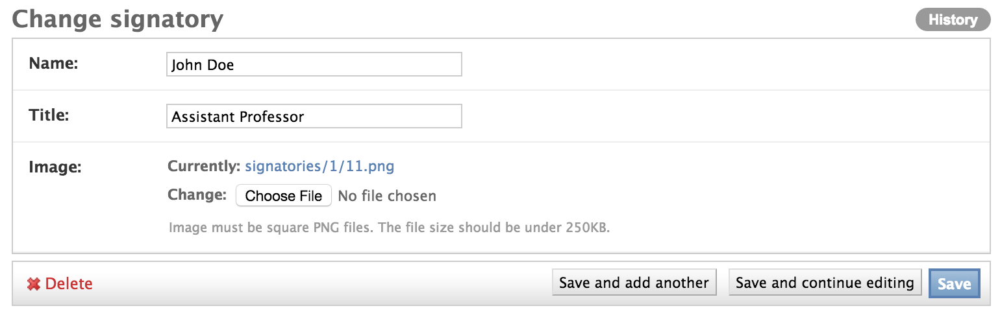
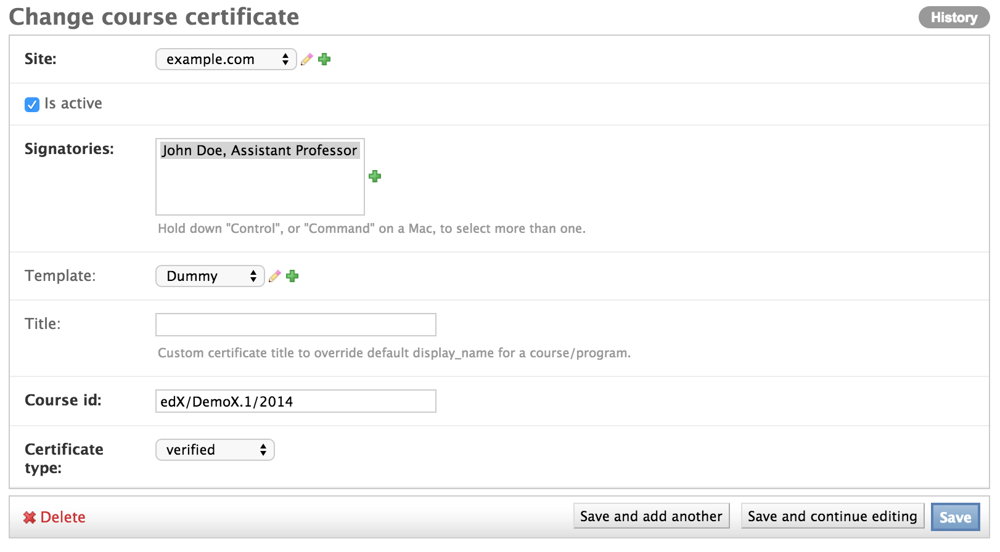
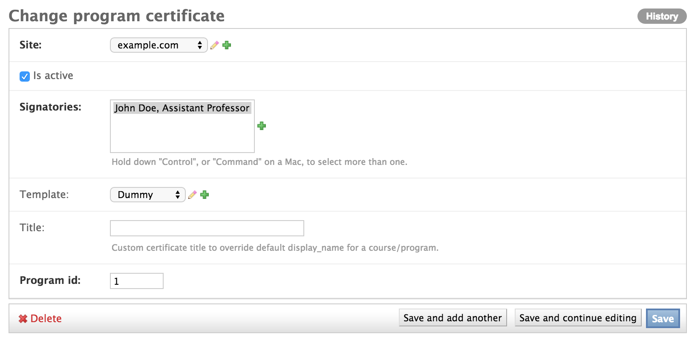

Credentials Administration
============================

This functionality allows you to configure a custom site.
To add this functionality, edX has extended the `Django sites framework <https://docs.djangoproject.com/en/1.8/ref/contrib/sites/>`_.
The Django sites framework allows you to map domains to a **Site** object, which consists of an ID and a name.

You must make sure that there is only one configuration per site.

Site Configuration Model
------------------------------

To add or update a custom site's configurations, including the basic theming, use the ``SiteConfiguration`` model.

The following image shows the ``SiteConfiguration`` model in the Django administration panel for a configured site.

All fields in the ``SiteConfiguration`` model are required.

Each site can have only one configuration.

Template Configuration  (Optional)
=====================================

This configuration adds certificate-specific templates.
This configuration is optional. If you do not add a certificate-specific template, certificates use the default template.

Template Configuration Model
------------------------------

To add or update a template's configuration, use the ``CertificateTemplate`` model.

The following image shows the ``CertificateTemplate`` model in the Django administration panel for a configured template.

.. image:: _static/images/template.png
    :width: 600px
    :alt: Populated template model

All fields in the ``CertificateTemplate`` model are required. The **Template Name** must be unique across all certificate templates in your course or organization.

Template Asset Model
----------------------

To upload templates to S3, use the ``CertificateTemplateAsset`` model. The ``CertificateTemplate`` model consumes the assets that you upload.

The following image shows the ``CertificateTemplateAsset`` model in the Django administration panel for a configured certificate template asset.

.. image:: _static/images/template_asset.png
    :width: 600px
    :alt: Populated template asset model

All fields in the ``CertificateTemplate`` model are required.

Signatory Configuration
==========================

This configuration adds certificate signatories.
This configuration is required. Every certificate must include at least one signatory.

Signatory Configuration Model
-------------------------------

To add or update a signatory's configuration, use the ``Signatory`` model.

The following image shows the ``Signatory`` model in the Django administration panel for a configured signatory.

All fields in the ``Signatory`` model are required.

Course Certificate Configuration
====================================

This configuration adds course certificates.
This configuration creates a new **CourseCertificate** object that is used to award course certificates to learners.

Course Certificate Configuration Model
----------------------------------------

To add or update a course certificate's configuration, use the ``CourseCertificate`` model.

The following image shows the ``CourseCertificate`` model in the Django administration panel for a configured course certificate.

The ``CourseCertificate`` model has a **unique together** constraint on the **Site**, **Course ID** and **Certificate type** fields.
In this model, the same site, course ID, and certificate type cannot have more than one entry.

Program Certificate Configuration
====================================

This configuration adds program certificates.
This configuration creates a new **ProgramCertificate** object that is used to award program certificates to learners.

Program Certificate Configuration Model
-----------------------------------------

To add or update a program certificate's configuration, use the ``ProgramCertificate`` model.

The following image shows the ``ProgramCertificate`` model in the Django administration panel for a configured program certificate.

