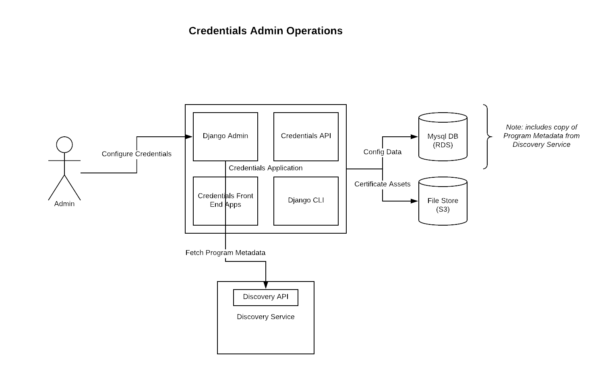
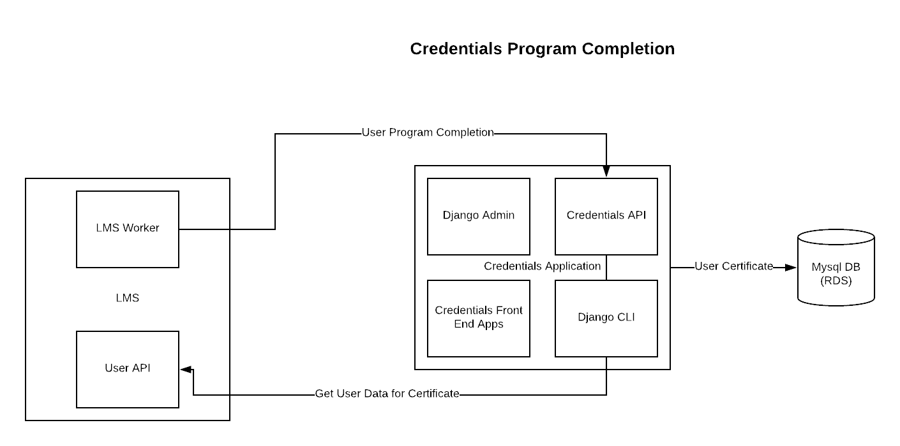
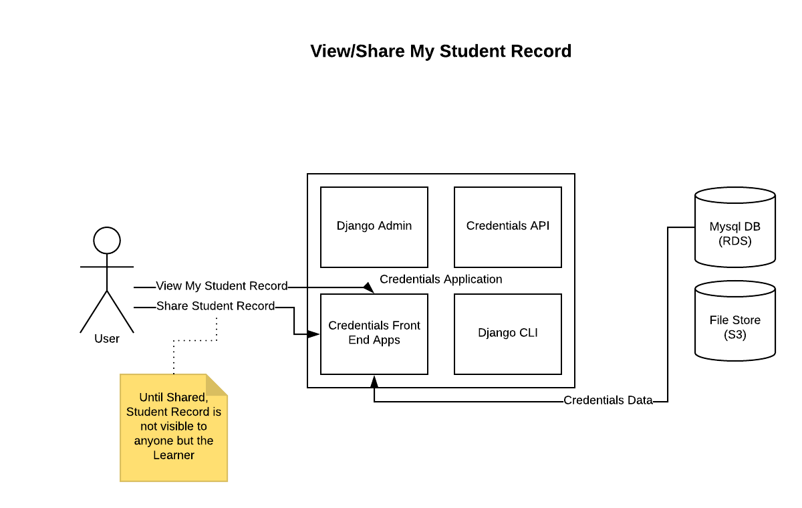
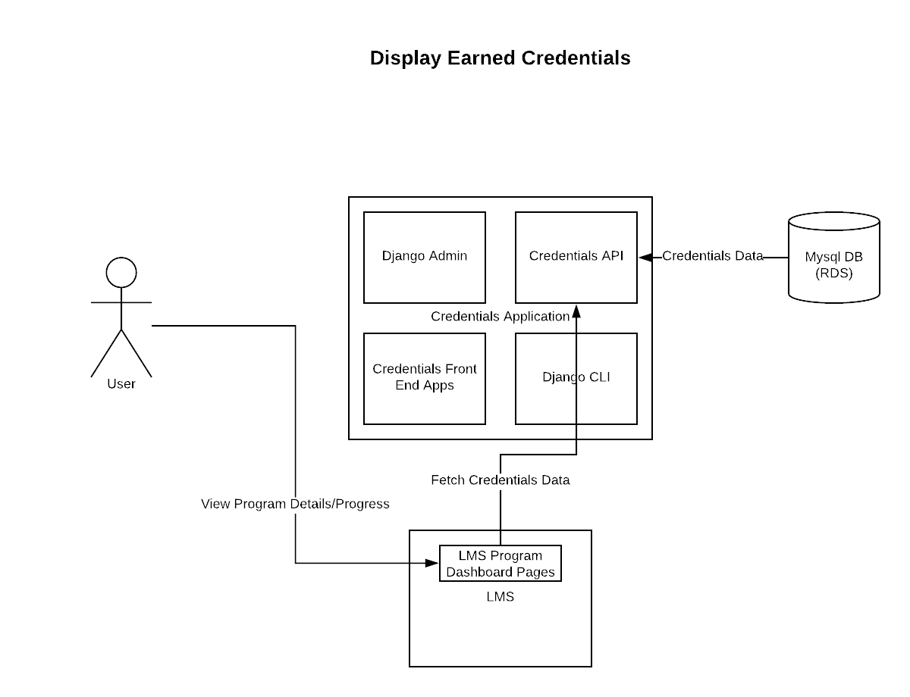
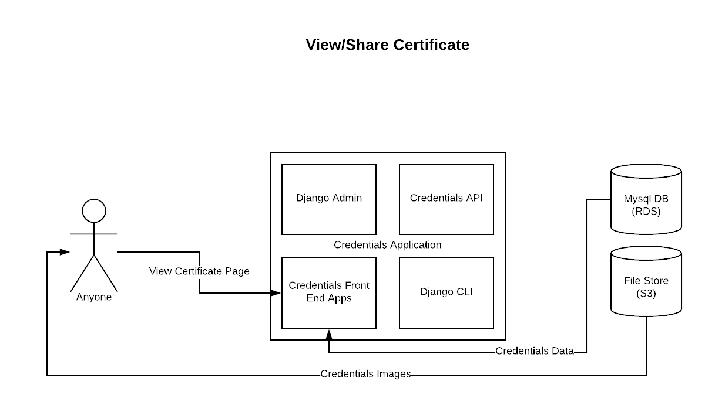
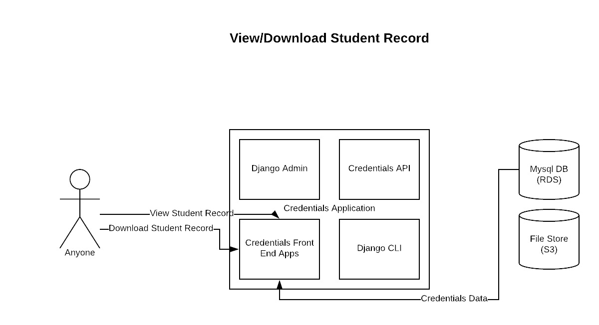
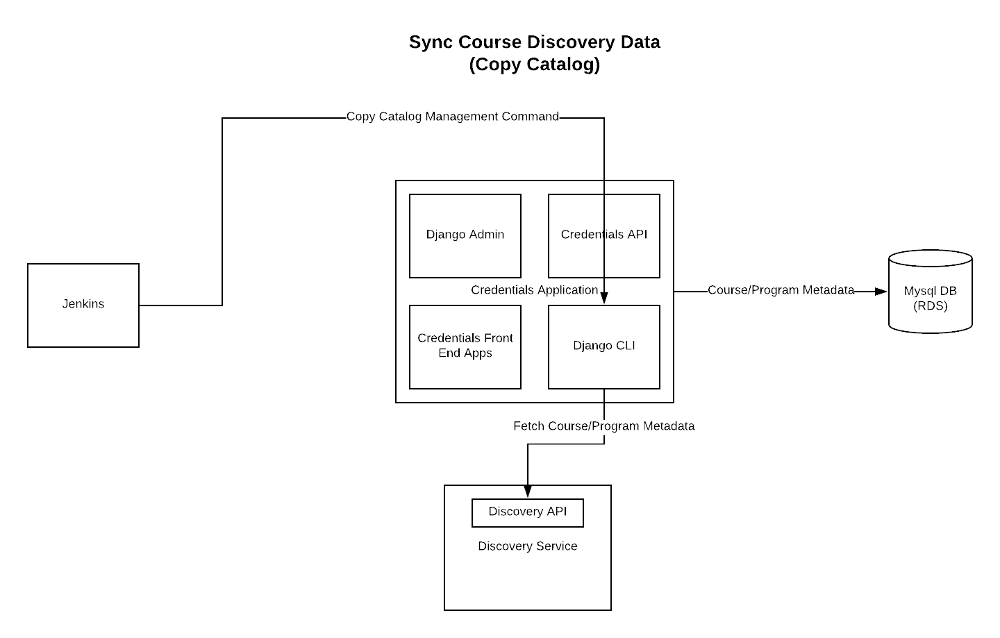
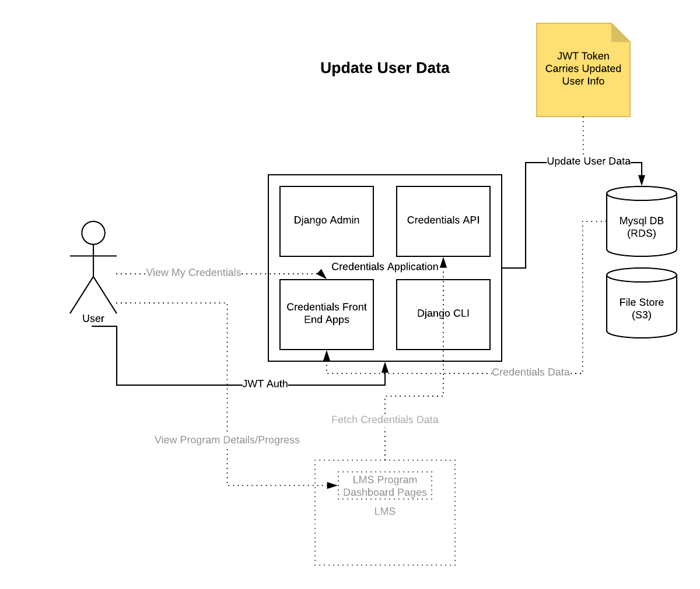

Overview
========

The Credentials Service stores and presents records of learners’ successful completion of learning materials in edx-platform.  At present, the service is responsible for certificates of completion for our various program offerings (which are curated sequences of courses relating to a specific field of study) and for the summary records for the courses therein.  The service is designed to be extensible to support any kind of credential awarded within the platform.  Certificates of course completion will eventually be migrated to this service, but for now they are handled by a different group of subsystems that includes the edX LMS.

The service interface consists of an HTTP API for creating/managing credentials (intended to be consumed by internal systems responsible for course completion/grading and the like), public / world-readable views of individual certificates that learners may view and share, and slightly differing public / private views of the student records for courses that are part of a program.

Data
====

The service is a source of truth for the following data:

User Credentials
----------------
Records of individual users’ completion of a certain learning material, at a certain point in time.   They are related to specific platform users via their LMS-assigned username.  User credentials may contain arbitrary user-defined name/value attribute pairs related to the context in which they were awarded.  They may also be assigned a “revoked” status, which essentially implements soft-deletion (credentials/certificates are no longer publicly accessible, but the stored data is retained).

Credential Configurations
-------------------------
Records relating specific learning objects, for which a credential may be awarded, to attributes that determine how those credentials will be displayed.  The learning objects (e.g. courses or programs) are referenced by their type and their ID in whatever external system is appropriate for that type. The configuration attributes generally consist of templates/assets used to render views, and metadata that is displayed in those templates (for example, the name of the institution which offered the learning material and the names of individual signatories).

Credential Assets
-----------------
Physical files that are used to present learner-facing certificate views.  For example, HTML templates and image files.

Learner Records
---------------
While the component data that contributes to a learner's program record is constituted from other services (LMS and the course-discovery IDA) and is owned by those services, the record that aggregates that information and makes it shareable is owned by the credentials service.

External Data Access
====================

The service uses external HTTP APIs to retrieve the following additional data when rendering credentials.  All of this data may be cached briefly (in memcache) or stored and synced regularly (in mysql DB) for performance reasons.

User Information
----------------
The service uses the user account API (hosted by the LMS) to retrieve additional information about the user, given their username.  At the moment only the full name of the user, their email address, and their username are needed.

Program Information
-------------------
The service uses an API provided by the course-discovery IDA to get additional information about a program (e.g. name, description, number of courses) in order to display certificates of completion for that program.

Organization Information
------------------------
The service uses another API provided by the course-discovery IDA to get additional information about credentialing organizations, given an ID.  The name and logo image associated with the organization are what is displayed.

Interactions
============

Internal Users: Credential Configuration and Administration
-----------------------------------------------------------

.. Editable in Lucidchart: https://www.lucidchart.com/documents/edit/3e27073a-cafc-4673-b8ed-be1553094faf/0

Internal Process: Program Completion
------------------------------------

.. Editable in Lucidchart: https://www.lucidchart.com/documents/edit/44048718-4f4c-4cc8-9f55-686339102f61/0

Learner-facing: Display Student Record
--------------------------------------

.. Editable in Lucidchart: https://www.lucidchart.com/documents/edit/4b8d8e80-3933-4165-86ab-73031245d998/0

Learner-facing: Display Earned Credentials
------------------------------------------

.. Editable in Lucidchart: https://www.lucidchart.com/documents/edit/efc777b5-0c7e-4ef8-8e47-0be1f9253088/0

World-facing: View / Share a Certificate
----------------------------------------

.. Editable in Lucidchart: https://www.lucidchart.com/documents/edit/f71a6d22-66b0-4031-b096-e9df43cf2ed6/0

World-facing: Display Student Record
------------------------------------

.. Editable in Lucidchart: https://www.lucidchart.com/documents/edit/4ed6a888-e78a-4411-a999-dbb1a9b4bea6/0

Internal Process: Sync Course Discovery Data (copy catalog)
-----------------------------------------------------------

.. Editable in Lucidchart: https://www.lucidchart.com/documents/edit/cc078240-9859-4697-982f-427b2237754c/0

Internal Process: Copy JWT Data
-------------------------------

.. Editable in Lucidchart: https://www.lucidchart.com/documents/edit/1d162c34-c1a4-407c-bd44-b35eb788e262/0

Key Components
==============
Django Applications:

* credentials.apps.core: defines key domain-neutral models and views.
* credentials.apps.credentials: defines the models essential to this domain, and implements user-facing credential views.
* credentials.apps.api: implements the HTTP API.
* credentials.apps.catalog: defines simplified Course/Program metadata models and implements the management command used for syncing data between course-discovery and credentials.
* credentials.apps.records: defines the models specific to student records and implements user-facing student record views.

Django Admin is presently used for configuring and managing credentials.

Service Dependencies
====================
* edx-platform: an LMS instance is needed to host User APIs, as well as the OAuth2 / SSO provider.
* course-discovery IDA: hosts the Programs and Organization APIs which is needed to fetch metadata when rendering program-related credentials, as described above.

AuthN / AuthZ
=============
* The edx-platform OAuth2 provider presently runs in the LMS process and can be used to initiate session-based authentication using the authorization code flow.
* API authentication via JWT tokens is supported; the JWT tokens must be issued by the platform auth provider.
* Preliminary support for domain-specific roles is in place, via Django groups and permissions (see migrations in the core application, as well as the authentication module in the api application).  However, only the learner and (global) administrator roles are fully supported.
* This service itself creates and signs JWT tokens which are used to authenticate to the external platform APIs it consumes data from (see above).
