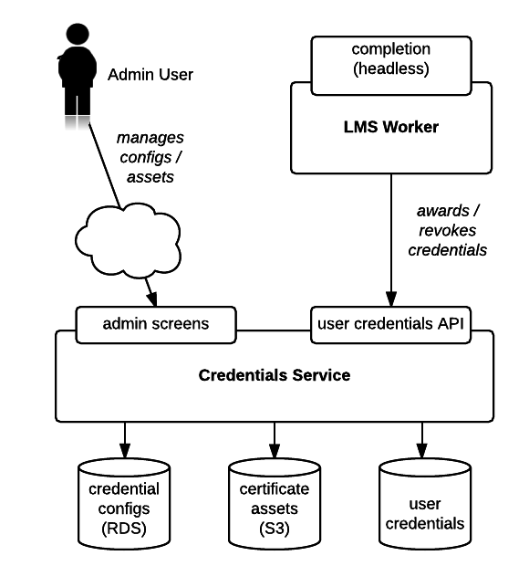
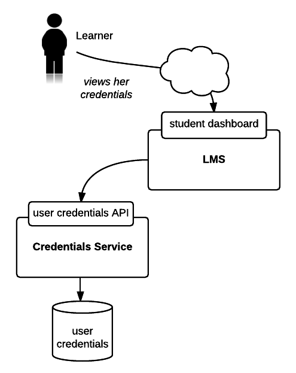
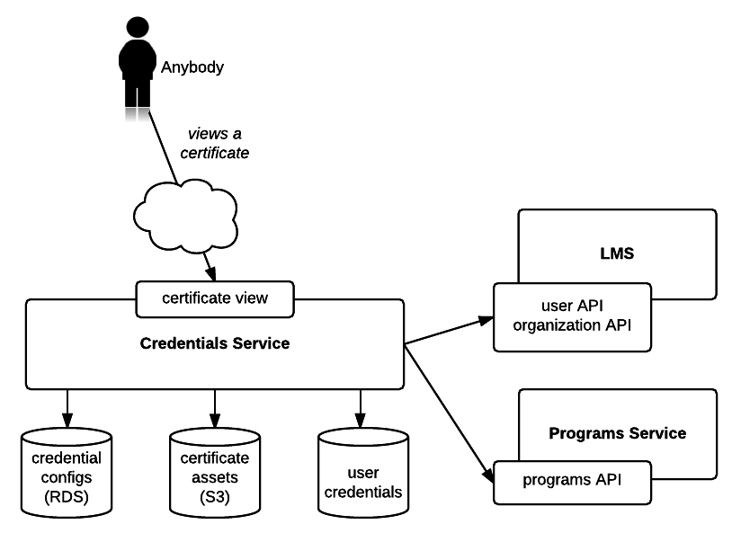

Overview
========

The Credentials Service stores and presents records of learners’ successful completion of learning materials in edx-platform.  At present, the service is only responsible for certificates of completion for XSeries Programs (which are curated sequences of courses relating to a specific field of study).  The service is designed to be extensible to support any kind of credential awarded within the platform, but was only recently rolled out and is not fully implemented.  Certificates of course completion will eventually be migrated to this service, but for now they are handled by a different group of subsystems that includes the edX LMS.

The service interface consists of an HTTP API for creating/managing credentials (intended to be consumed by internal systems responsible for course completion/grading and the like), and public / world-readable views of individual certificates that learners may view and share.

Data
====

The service is a source of truth for the following data:

User Credentials
----------------
Records of individual users’ completion of a certain learning material, at a certain point in time.   They are related to specific platform users via their LMS-assigned username.  User credentials may contain arbitrary user-defined name/value attribute pairs related to the context in which they were awarded.  They may also be assigned a “revoked” status, which essentially implements soft-deletion (credentials/certificates are no longer publicly accessible, but the stored data is retained).

Credential Configurations
-------------------------
Records relating specific learning objects, for which a credential may be awarded, to attributes that determine how those credentials will be displayed.  The learning objects (e.g. courses or programs) are referenced by their type and their ID in whatever external system is appropriate for that type. The configuration attributes generally consist of templates/assets used to render views, and metadata that is displayed in those templates (for example, the name of the institution which offered the learning material and the names of individual signatories).

Credential Assets
-----------------
Physical files that are used to present learner-facing certificate views.  For example, HTML templates and image files.

External Data Access
====================

The service uses external HTTP APIs to retrieve the following additional data when rendering credentials.  All of this data may be cached briefly for performance reasons.

User Information
----------------
The service uses the user account API (hosted by the LMS) to retrieve additional information about the user, given their username.  At the moment only the full name of the user is needed.

Organization Information
------------------------
The service uses the organizations API (also exposed by LMS) to retrieve additional information about credentialing organizations, given an ID.  The name and logo image associated with the organization are what is displayed.

Program Information
-------------------
The service uses an API provided by the Programs IDA to get additional information about an XSeries program (e.g. name, description, number of courses) in order to display certificates of completion for that program.

Interactions
============

Internal: Credential Configuration and Administration
-----------------------------------------------------

Learner-facing: Display Earned Credentials
------------------------------------------

World-facing: View / Share a Certificate
----------------------------------------

Key Components
==============
Django Applications:

* credentials.apps.core: defines key domain-neutral models and views.
* credentials.apps.credentials: defines the models essential to this domain, and implements user-facing credential views.
* credentials.apps.api: implements the HTTP API.

Django Admin is presently used for configuring and managing credentials.

Service Dependencies
====================
* edx-platform: an LMS instance is needed to host User and Organization APIs, as well as the OAuth2 / SSO provider.
* programs IDA: hosts the Programs API which is needed to fetch metadata when rendering program-related credentials, as described above.

AuthN / AuthZ
=============
* The edx-platform OAuth2 provider presently runs in the LMS process and can be used to initiate session-based authentication using the authorization code flow.
* API authentication via JWT tokens is supported; the JWT tokens must be issued by the platform auth provider.
* Preliminary support for domain-specific roles is in place, via Django groups and permissions (see migrations in the core application, as well as the authentication module in the api application).  However, only the learner and (global) administrator roles are fully supported.
* This service itself creates and signs JWT tokens which are used to authenticate to the external platform APIs it consumes data from (see above).
