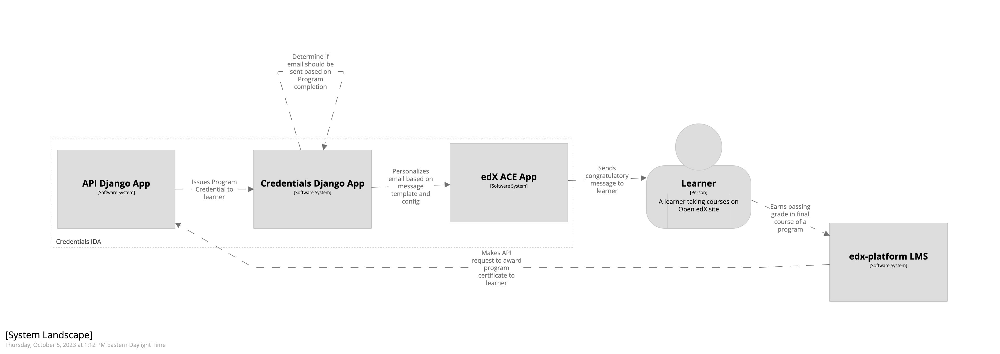
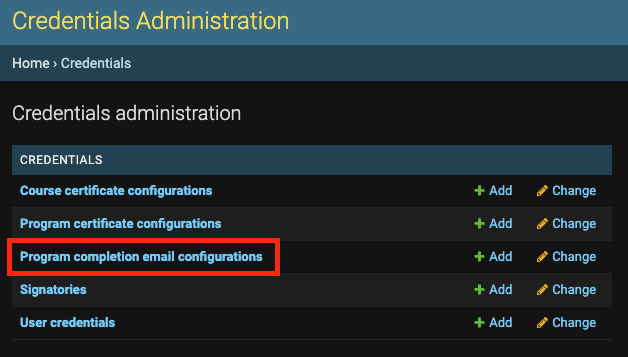

Program Completion Emails
=========================

The Credentials IDA can be configured to send a congratulatory message to learners upon successful completion of their
programs.

Learners will only receive a single message per Program. If a learner was to have a program credential revoked (e.g.
they are no longer passing a course that is part of the program), and then re-earn their program certificate at a later
date, they will *not* receive another completion message.

This feature supports defining both HTML and PlainText message templates and uses `edX ACE`_ to send the messages.

Configuration
-------------

This feature is gated by both a feature flag and some additional configuration (in the form of a
**Program Completion Email Configuration**).

Feature Flag
~~~~~~~~~~~~

To enable this feature the ``SEND_EMAIL_ON_PROGRAM_COMPLETION`` setting must be added to the Credential IDA's
configuration and set to **True**. This feature is disabled by default.

Program Completion Email Configuration
~~~~~~~~~~~~~~~~~~~~~~~~~~~~~~~~~~~~~~

Once the feature is enabled, an Open edX Administrator must create a **Program Completion Email Configuration** that
defines the content of the messages sent to learners. These configurations are managed via Django Admin.

The first step is adding a unique **identifier** for the configuration. If you would like a base template that defines
a message for all program completers, this identifier should be ``default``. If you would like a message to be sent to
all learners of a specific Program type, the identifier should be the program type slug (e.g.
``professional-certificate``, ``xseries``, or ``masters``). If you would like a message to be sent to all learners of a
specific Program, the identifier should be the Program's UUID (from Discovery).

By default, the HTML templates support the following elements: ``a``, ``b``, ``blockquote``, ``div``, ``em``, ``i``,
``li``, ``ol``, ``p``, ``span``, ``strong``, ``ul``, and heading levels ``h1`` through ``h6``. The list of acceptable
HTML elements can be modified by updating the ``ALLOWED_EMAIL_HTML_TAGS`` setting in the Credentials configuration.

Lastly, the ``Enabled`` checkbox must be enabled to enable the configuration.

How It Works
------------

When sending a Program Completion Email, the system will select the **most specific** template to a learner. Consider
the following scenario. There is a default configuration, a **Professional Certificate**  program type configuration,
and a configuration for a specific Program (we will refer to it as **Program A**).

* Learner 1 is enrolled in **Program A**. Upon completion, they will receive the program specific **Program A** message.
* Learner 2 is enrolled in a **Professional Certificate** program. Upon completion, they will receive the program level
  message.
* Learner 3 is enrolled in an **XSeries** program. Upon completion, they will receive the default message (as there is
  no program specific template nor a template defined for the **XSeries** program type).

If there is no default template defined a learner will not receieve any message from the system upon completion of
their program.

.. _edX ACE: https://github.com/openedx/edx-ace
