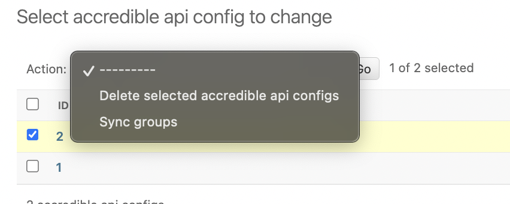

.. _badges-accredible-configuration:

Accredible Configuration
========================

.. _badges-accredible-api-configs:

Accredible API Configurations
-----------------------------

Multiple Accredible API Configurations can be configured.
All communication between Open edX Credentials and Accredible happens on behalf of an Accredible API config.

Go to the Accredible API Configs section in the admin panel and create a new item:

#. Set the **name** for the config.
#. Set the **API key** used to sync the Accredible account.

If errors occur, verify the credentials used for the API Config.

Groups
------

*Accredible groups* (the Accredible equivalent of badge templates) are created in the Accredible dashboard, then retrieved by the Credentials service via API.

Synchronization
~~~~~~~~~~~~~~~

To synchronize Accredible groups for an API Configuration:

#. Navigate to the "Accredible API Configs" list page.
#. Select the API Config.
#. Use the ``Sync groups`` action.

On success, the system updates the list of Accredible groups.

- New group records are created inactive (disabled).

Configure requirements (see :ref:`badges-configuration-requirements`) and activate the group (see :ref:`badges-configuration-activation`) before it takes effect.
