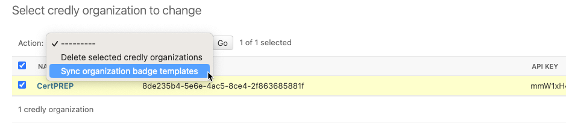
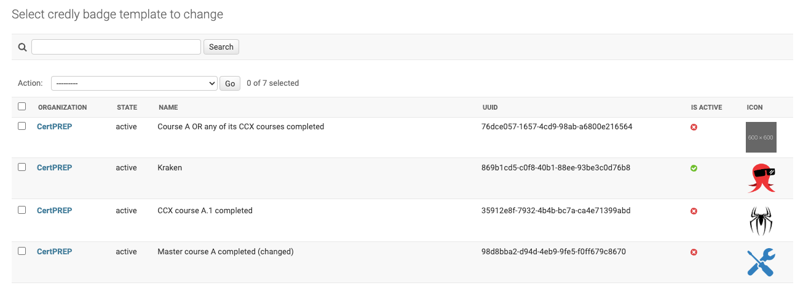

.. _badges-credly-configuration:

Credly Configuration
====================

.. _badges-credly-organizations:

Credly Organizations
--------------------

Multiple Credly Organizations can be configured.
All communication between Open edX Credentials and Credly happens on behalf of a Credly Organization.

Go to the Credly Organization section in the admin panel and create a new item:

#. Set the **UUID** to your Credly Organization identifier.
#. Set the **authorization token** used to sync the Credly Organization.

The system pulls the Organization's details and updates its name.
If errors occur, verify the credentials used for the Organization.

Badge Templates
---------------

*Credly badge templates* are created in the Credly Organization's dashboard.
Once published, they are retrieved by the Credentials service via API.

Webhooks
~~~~~~~~

.. note::

   Webhooks connect Credly with an external platform so your server is notified about events within Credly.

Webhooks are set up on the Credly management dashboard — Credly initiates the synchronization.

Select an action from the list so that whenever the specified action occurs, your system is notified.
Without this synchronization, the external system will not learn about changes (e.g. a template update or archival) and may issue outdated badges.

Synchronization
~~~~~~~~~~~~~~~

To synchronize Credly badge templates for an Organization:

#. Navigate to the "Credly Organizations" list page.
#. Select the Organization.
#. Use the ``Sync organization badge templates`` action.

On success, the system updates the list of badge templates for that Organization.

- Only badge templates with ``active`` state are pulled.
- New badge template records are created inactive (disabled).

Configure requirements (see :ref:`badges-configuration-requirements`) and activate the template (see :ref:`badges-configuration-activation`) before it takes effect.
