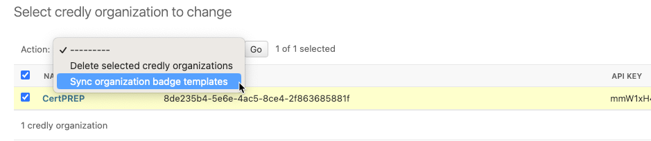
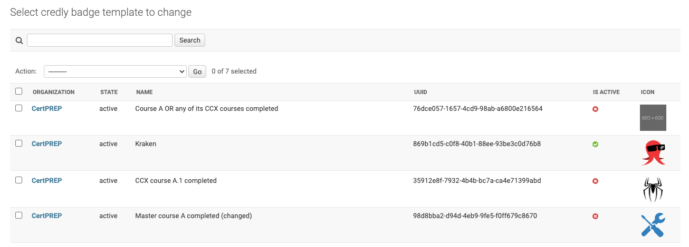

.. _badges-credly-configuration:

Credly Configuration
====================

.. _badges-credly-organizations:

Credly Organizations
--------------------

Multiple Credly Organizations can be configured.
Each Credly Organization record stores the credentials and organization identifier that Open edX Credentials uses to sync badge templates and issue badges for that Credly organization.

To configure a Credly organization in Open edX Credentials, navigate to ``https://<your-credentials-host>/admin/badges/credlyorganization/`` and add a new organization:

#. Set the **UUID** to your Credly Organization identifier.
#. Set the **API key** used to authenticate with the Credly Organization.

.. note::

   Credly API keys have a limited lifetime of 180 days. Rotate them before expiry — see :ref:`badges-credly-token-rotation`.

The system pulls the Organization's details and updates its name.
If errors occur, verify the API key and UUID for the Organization.

.. _badges-credly-token-rotation:

API Key Rotation
----------------

Credly authorization tokens (API keys) expire 180 days after they are issued.
Once a token expires, badge issuing, revocation, and template synchronization for that Organization fail until you replace the key.

Open edX Credentials records when each Organization's token was issued and last rotated, and ships the ``refresh_credly_authorization_tokens`` management command to keep tokens alive:

- When a token expires in 30 days or fewer, the command logs a warning.
- When fewer than 5 days remain, the command rotates the token through the Credly API and stores the new value on the Credly Organization record. The previous token becomes invalid immediately.
- When the token issuance date is unknown (for example, the Organization was configured before token dates were tracked), the command logs a warning and does not rotate. Rotate such tokens once with ``--force`` to start tracking.

Check all configured Organizations:

.. code-block:: bash

   ./manage.py refresh_credly_authorization_tokens

Check a single Organization:

.. code-block:: bash

   ./manage.py refresh_credly_authorization_tokens --organization_id <credly-organization-uuid>

Rotate immediately, regardless of the remaining lifetime:

.. code-block:: bash

   ./manage.py refresh_credly_authorization_tokens --force

.. warning::

   Rotation invalidates the current token on the Credly side.
   If other services authenticate with the same Credly Organization token, they lose access until you share the new token with them.

Scheduled Rotation
~~~~~~~~~~~~~~~~~~

Run the command on a schedule so tokens are checked and rotated without operator involvement.
A daily run is sufficient — the command only acts when a token approaches expiry.

Use the scheduling mechanism of your deployment: a cron job on the Credentials host, a Kubernetes ``CronJob``, or your job runner of choice.
For example, with cron:

.. code-block:: bash

   # Check Credly tokens every day at 03:00.
   0 3 * * * cd /path/to/credentials && ./manage.py refresh_credly_authorization_tokens

Review the command output in your logs: warnings signal tokens nearing expiry, and errors signal failed rotations that need manual attention.

Badge Templates
---------------

Credly badge templates are created in the `Credly Organization dashboard <https://credlyissuer.zendesk.com/hc/en-us/articles/360028654791-Creating-a-badge-template>`_.
After a template is published, Open edX Credentials can import it either through manual synchronization or through Credly webhook events.

Webhooks
~~~~~~~~

Webhooks keep Open edX Credentials in sync with changes made in your Credly organization. Configure them if you want badge template changes in Credly, such as creating, updating, publishing, or archiving templates, to be reflected in Open edX Credentials automatically instead of waiting for a manual synchronization.

Configure a webhook in the Credly management dashboard to point to your Credentials service:

``https://<your-credentials-host>/badges/credly/webhook/``

For Credly-side webhook setup details, see `Create a webhook callback URL <https://docs.credly.com/browse/reference/post_webhook-callback-url>`_.

Open edX Credentials handles the following Credly webhook event types:

- ``badge_template.created`` - a new badge template is published.
- ``badge_template.changed`` - a badge template is updated or archived. If the template state is no longer ``active``, Credentials automatically deactivates it.
- ``badge_template.deleted`` - a badge template is removed.

Synchronization
~~~~~~~~~~~~~~~

To synchronize Credly badge templates for an Organization:

#. Navigate to ``https://<your-credentials-host>/admin/badges/credlyorganization/`` and select the Organization.
#. Run the ``Sync organization badge templates`` action.

On success, the system fetches all badge templates whose state is ``active`` on the Credly side. Pagination is handled automatically.

New badge template records in Open edX Credentials are created inactive (disabled).

Use the badge templates list at ``https://<your-credentials-host>/admin/badges/credlybadgetemplate/`` to confirm the expected active templates were imported before you configure requirements.

Configure requirements (see :ref:`badges-configuration-requirements`) and activate the template (see :ref:`badges-configuration-activation`) before it takes effect.

.. seealso::

   `Credly Authentication Methods <https://docs.credly.com/browse/docs/authentication-methods>`_
      How to authenticate with the Credly API.

   `Auth Tokens for Authorization <https://credlyissuer.zendesk.com/hc/en-us/articles/28143019451035-Auth-tokens-for-authorization>`_
      How to generate and manage Credly auth tokens.

