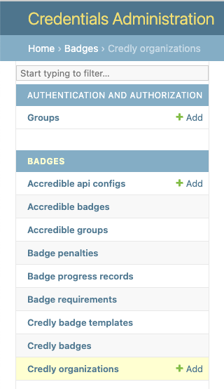
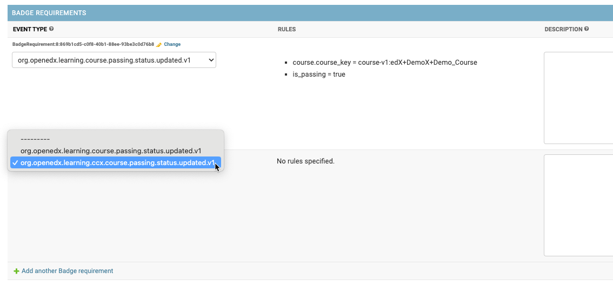
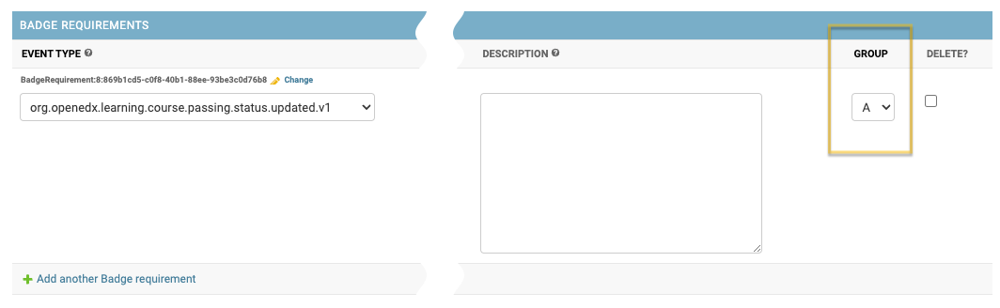
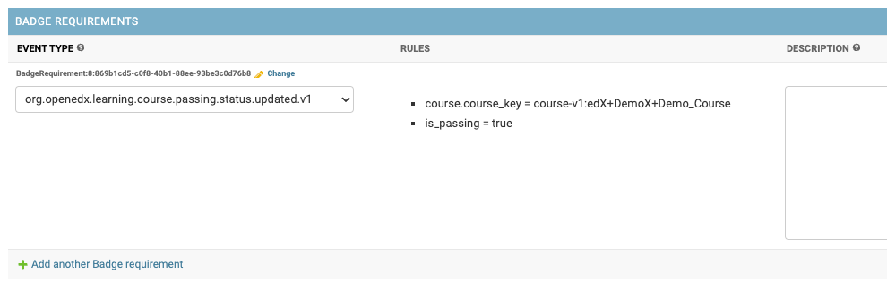
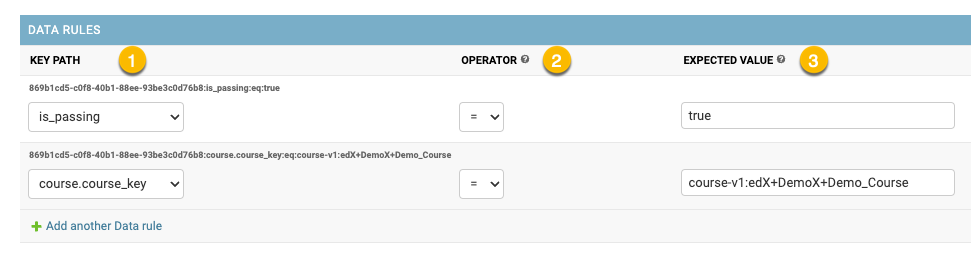
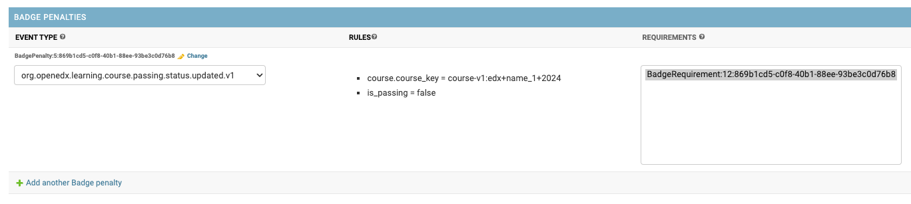
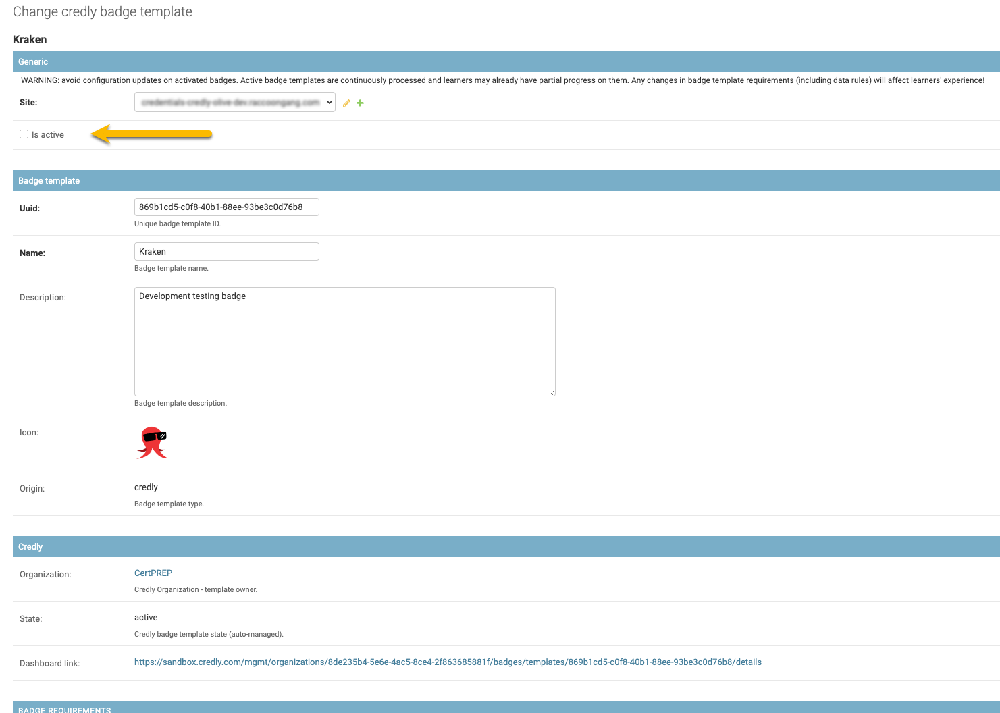

.. _badges-configuration:

Badging Configuration
=====================

Badge templates, requirements, rules, and penallties are configured in the Credentials admin panel.
Each badge template needs at least one requirement and must be activated before it takes effect.

.. note::

   Accredible uses the term "group" for what Credly calls a "badge template." This section uses "badge template" as the generic term for both.

Provider Setup
--------------

Provider setup (organization credentials, template synchronization) differs per badging provider.

.. toctree::
   :maxdepth: 1

   credly
   accredible

.. _badges-configuration-requirements:

Badge Requirements
------------------

Requirements describe what must happen for a learner to earn a badge.
At least one requirement must be associated with a badge template.

Badge requirements are listed inline on the badge template detail page.

A badge template can have multiple requirements.
All requirements must be *fulfilled* before the system issues a badge.

.. _badges-configuration-groups:

Each requirement has the following fields.

- **Event type** - the event that must occur. Available event types are pre-configured in the application settings.
- **Rules** - a list of configured data rules (if any). See :ref:`badges-configuration-data-rules`.
- **Description** - an optional human-readable reminder about the requirement's purpose.
- **Group** - by default each requirement belongs to its own group. You can assign two or more requirements to the same group - the group is fulfilled when *any* of its requirements is fulfilled ("OR" logic inside a group).

.. note::

   Any public signal from the `openedx-events`_ library can be used, provided it includes user PII (``UserData``) so learners can be identified.

See :ref:`Configuration examples for Badging`.

.. _badges-configuration-data-rules:

Data Rules
----------

Data rules narrow a badge requirement based on the expected event payload.

To add or edit a data rule:

#. Navigate to the badge requirement detail page (use the ``Change`` inline link).
#. Find the "Data Rules" section and add a new item.

Each data rule describes a single expected payload value.
Key paths are generated from the event type of the parent requirement.

.. list-table::
   :widths: 20 80
   :header-rows: 1

   * - Field
     - Description
   * - **Key path**
     - Dot-separated path to the target attribute. Each event type has a pre-defined set of key paths.
   * - **Operator**
     - Comparison operation: ``"="`` (equals) or ``"!="`` (not equals).
   * - **Expected value**
     - The value to compare against. Boolean positives: ``"true"``, ``"True"``, ``"yes"``, ``"Yes"``, ``"+"``. Boolean negatives: ``"false"``, ``"False"``, ``"no"``, ``"No"``, ``"-"``.

See :ref:`Configuration examples for Badging` for details.

.. _badges-configuration-penalties:

Badge Penalties
---------------

Penalties reset badge progress based on learner activity.
They are optional - a badge template can have zero or more.

Each penalty targets one or more badge requirements.
A penalty uses the same structure as a requirement, but *decreases* progress instead of advancing it.
When all penalty rules match, the learner's progress toward the badge resets.

.. _badges-configuration-activation:

Activation
----------

After configuring requirements, activate the badge template:

#. Navigate to the badge template detail page.
#. Check the ``Is active`` checkbox.

.. important::

   An activated badge template starts working immediately.

.. list-table::
   :widths: 50 50
   :header-rows: 0

   * - Core credential attributes
     - Shared across all credential types.
   * - Badge template credential attributes
     - Specific to badges.
   * - Provider-specific attributes
     - State, dashboard link, etc. Varies by provider (see :ref:`badges-credly-configuration` or :ref:`badges-accredible-configuration`).
   * - Configured requirements
     - See :ref:`badges-configuration-requirements`.

.. _openedx-events: https://github.com/openedx/openedx-events
