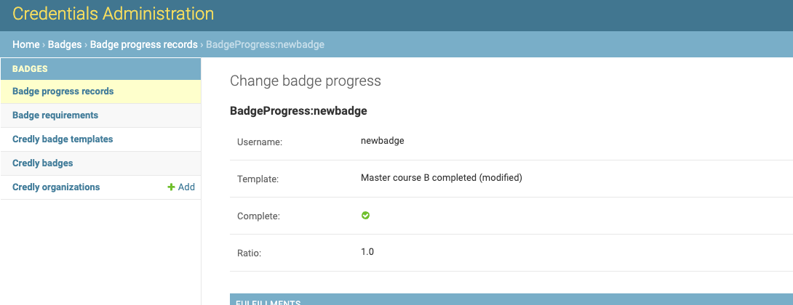

.. _badges-processing:

Badges Processing
==================

Incoming events are processed asynchronously in a separate event bus consumer process.
See the Event Bus documentation for details.

Events subscription
-------------------

Only explicitly configured `event types`_ take part in the processing.
See :ref:`badges-settings` for the default set of supported events.
Any public signal from the `openedx-events`_ library can extend this set,
provided its payload includes learner PII (``UserData`` object).

Learner identification
----------------------

The system identifies a learner by the ``UserData`` object in the event
payload. If the learner is not found, the event is ignored. The system also
ensures that the learner exists in the Credentials service (creates if needed).

Requirements analysis
---------------------

Since any requirement is associated with a single event type, all relevant
requirements are collected for the incoming signal:

1. appropriate event type;
2. active badge templates;

Each requirement's rules are checked against the event payload.
Requirement processing is skipped as soon as any rule doesn't match.

Progress update
---------------

Current learners' badge progress is stored in the ``Badge Progress`` record.
Badge templates can have more than one requirement, so the system tracks
intermediate progress.

Once all rules of the processed requirement apply, the system:

1. ensures there is the badge progress record for the learner;
2. marks the requirement as fulfilled for the learner;

If a Badge Progress is recognized as completed (all requirements for the
badge template are fulfilled), the system initiates the awarding process.

Badge awarding
--------------

On badge progress completion, the system:

1. creates an *internal* user credential record for the learner;
2. notifies (public signal) about new badge awarded;
3. tries to issue an *external* badge for the learner;

The Badges application implements extended ``UserCredential`` versions
(``CredlyBadge`` and ``AccredibleBadge``) to track external issuing state.
Once a badge is successfully issued, the corresponding record is updated
with its external UUID and state.

.. _event types: https://docs.openedx.org/projects/openedx-events/en/latest/
.. _openedx-events: https://github.com/openedx/openedx-events

Badge revocation
----------------

Badges can be revoked through badge penalties - rules that reset progress
when a requirement is no longer fulfilled. See the :ref:`badges-configuration`
section for penalty setup.

Each penalty is linked to a specific requirement. When the penalty conditions
match, the system resets the learner's progress for that requirement.

When a badge is revoked, the system updates its internal records.
For Credly, status changes from ``awarded`` to ``revoked``.
For Accredible, status changes from ``awarded`` to ``expired``.

A badge cannot be reissued once revoked.
