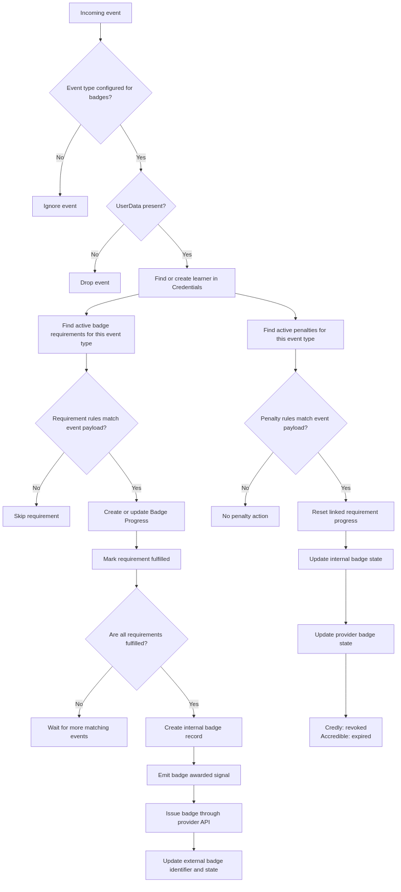

.. _badges-processing:

Badges Processing
==================

Incoming events are processed asynchronously in a separate event bus consumer process.
See :ref:`badges-event-bus-configuration` for setup details.

This page explains how badge-related events are evaluated, how learner progress is tracked, and how badges are awarded or revoked.
The flowchart below gives a high-level view of that process.

   An incoming event can either fulfill badge requirements and move a learner toward badge issuance, or match a penalty and reset previously earned progress.

Supported events
----------------

Only explicitly configured `event types`_ take part in the processing.
See :ref:`badges-settings` for the default set of supported events.
Any public signal from the `openedx-events`_ library can extend this set,
provided its payload includes learner PII (``UserData`` object).

Learner identification
----------------------

The system identifies a learner by the ``UserData`` object in the event payload.
If ``UserData`` is absent from the payload, the event is dropped.
If the learner does not yet exist in the Credentials service, the system creates a local user record automatically.

Requirement matching
--------------------

Each badge requirement is configured with a single :ref:`event type <badges-configuration-requirements>`.
For an incoming event, the system selects requirements configured for that event type and belonging to active badge templates.
The system then checks each requirement's rules against the event payload.
If any rule does not match, that requirement is skipped.

Progress tracking
-----------------

Current learner badge progress is stored in ``Badge Progress`` records.
Badge templates can have more than one requirement, so the system tracks intermediate progress before a badge is issued.
You can review progress records in the Credentials admin at ``<credentials-host>/admin/badges/badgeprogress/``.

When a requirement's rules match the incoming event, the system ensures there is a badge progress record for the learner and marks that requirement as fulfilled.

.. figure:: ../../_static/images/badges/badges-admin-progress-records.png
   :alt: Django admin list of badge progress records, showing learner progress tracked before a badge is awarded.

Use this admin view to confirm whether incoming events are advancing learner progress or whether penalties are resetting it.

If all requirements for a badge template are fulfilled, the system starts the awarding process.

Badge awarding
--------------

When badge progress is complete, the system creates an internal badge record for the learner, emits a public badge-awarded signal, and then tries to issue the badge through the provider API.

Provider-specific badge records (``CredlyBadge`` and ``AccredibleBadge``) store the external issuing state.
Once a badge is successfully issued, the corresponding record is updated with its external identifier and state.

.. _event types: https://docs.openedx.org/projects/openedx-events/en/latest/
.. _openedx-events: https://github.com/openedx/openedx-events

Badge revocation
----------------

Penalties can reset badge progress when a specific event occurs.
Each penalty listens for its own event type and has its own data rules - it fires when all of its rules match an incoming event, not when a requirement becomes unfulfilled.

A penalty targets one or more requirements (many-to-many relationship).
When a penalty fires, the system resets the learner's progress for all linked requirements.
See the :ref:`badges-configuration-penalties` section for penalty setup.

When a badge is revoked, the system updates its internal records.
For Credly, status changes from ``awarded`` to ``revoked``.
For Accredible, status changes from ``awarded`` to ``expired``.

.. warning::

   Once a badge has been revoked, it cannot be awarded again through badge processing.
