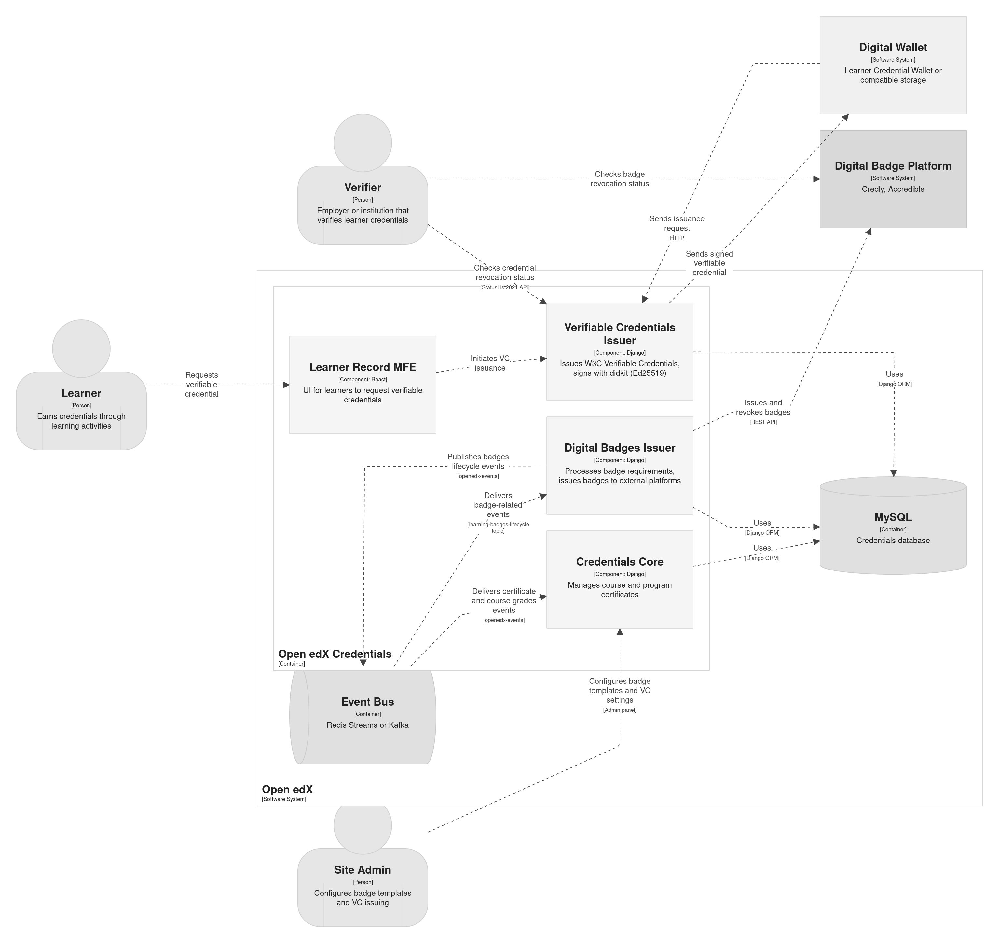
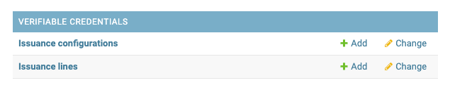
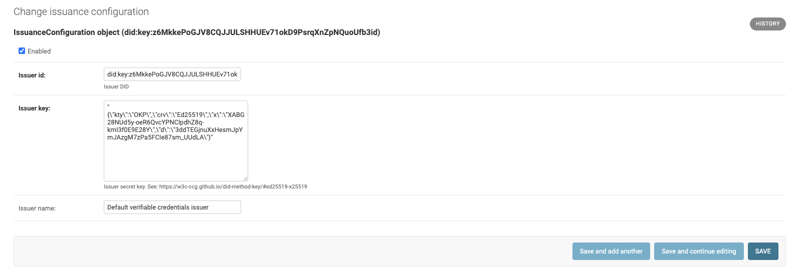
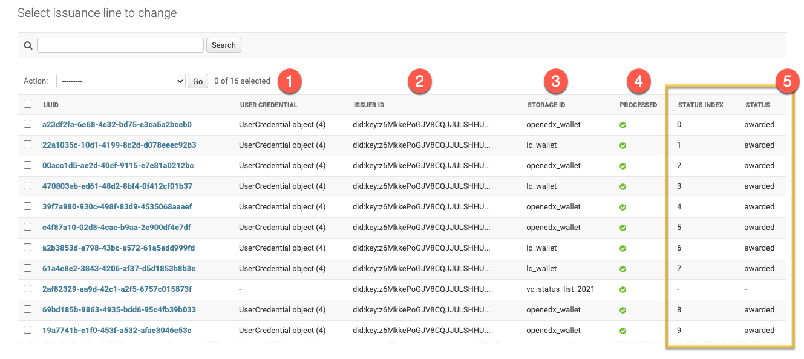
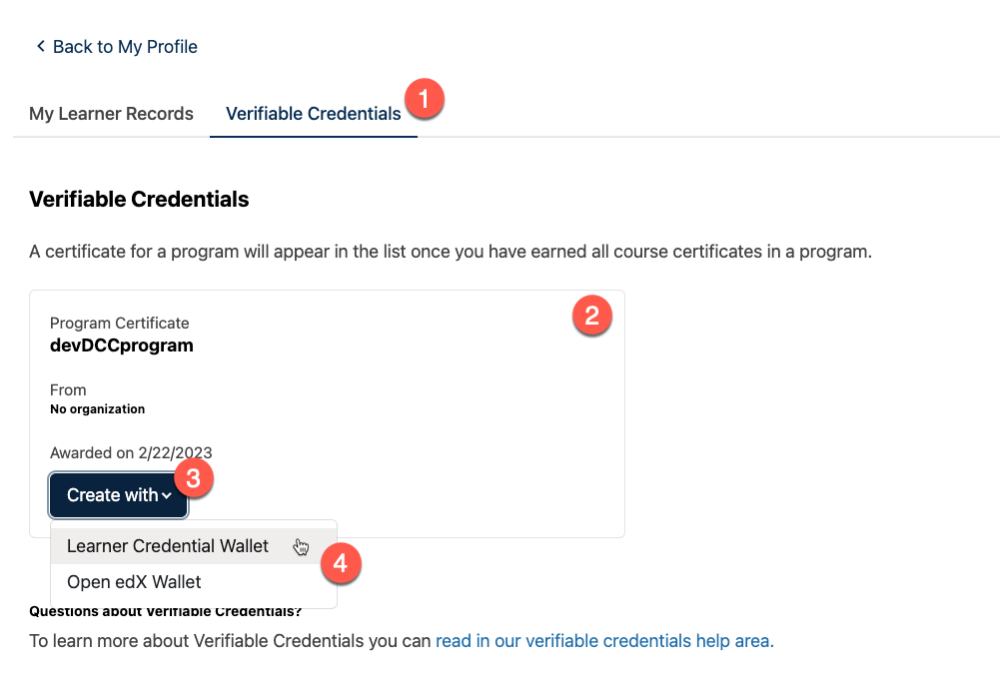

.. _vc-components:

Components
==========

This page explains the main Open edX components involved in verifiable credential issuance, delivery, and verification.

The diagram below provides a C4 component view of how the verifiable credentials feature fits into the broader Credentials service and learner-facing flow.

The Verifiable Credentials feature includes the following parts:

- **Verifiable Credentials application** (``credentials.apps.verifiable_credentials`` within the Open edX Credentials IDA);
- **Learner Record MFE** (``frontend-app-learner-record`` micro-frontend);
- third-party plugins (see :ref:`vc-extensibility`);
- digital wallets (see :ref:`vc-storages-page`).

.. _vc-application:

Verifiable Credentials application
----------------------------------

The core backend logic and all related APIs are encapsulated in the `Verifiable Credentials application`_.

Once the Verifiable Credentials feature :ref:`is enabled <vc-configuration>`, the Credentials IDA exposes additional functionality:

1. The **Verifiable Credentials** section appears in the Django admin.
2. Verifiable credentials URLs are added to the service.
3. Verifiable credentials API endpoints become available. See :ref:`vc-api-reference`.

.. _vc-administration-site:

Administration site
~~~~~~~~~~~~~~~~~~~

In the Django admin, the **Verifiable Credentials** section includes these main pages:

- **Issuance Configurations** at ``<credentials-host>/admin/verifiable_credentials/issuanceconfiguration/`` for managing issuer records.
- **Issuance Lines** at ``<credentials-host>/admin/verifiable_credentials/issuanceline/`` for reviewing individual verifiable credential issuance requests.

Issuance Configuration
    An issuance configuration describes an Issuer - the Organization/University/School
    on behalf of which verifiable credentials are created. The Issuer's ID is embedded
    in each verifiable credential, and a cryptographic proof is generated using the
    Issuer's private key. Each Issuer has a display name and can be deactivated via
    its checkbox. Only a single Issuer configuration can be active at a time.

.. note::
    The private key is a secret generated using cryptographic software.
    The Issuer ID must be a `decentralized identifier`_ derived from that private key.

Issuance Line
    Each request for a verifiable credential initiates a separate Issuance Line.
    It tracks the verifiable credential processing lifecycle and maintains a link
    to the source Open edX user achievement.

Each issuance line has a unique identifier `UUID` and includes the following information:

1. **User Credential** - related Open edX achievement (e.g. "Program Certificate" or "Course Certificate")
2. **Issuer ID** - issuer which signs this verifiable credential
3. **Storage ID** - a storage backend (digital wallet) which will keep a verifiable credential
4. **Processing status** - if a verifiable credential was successfully uploaded to storage
5. **Status list info** - indicates if a verifiable credential is still valid and unique status index within an Issuer's status list

Additionally every issuance line stores the following fields for debug purposes:

- **Subject ID** - verifiable credential subject DID
- **Data model ID** - verifiable credential specification to use
- **Expiration date** - optional expiration timestamp for the verifiable credential

.. _vc-status-list-api:

Status List API
~~~~~~~~~~~~~~~

There are several reasons a verifiable credential may already be invalid, inactive, or disposed:

- revocation
- implicit expiration
- other status changes

Open edX maintains status for internal credentials ("awarded", "revoked").

The public Status List API allows instant verifiable credential checks. This endpoint
is intentionally public (unauthenticated) so that relying parties can verify credential
status without credentials of their own. Each issuer maintains its own status sequence,
and every issued verifiable credential occupies a unique position in that sequence. For
more details, see :ref:`vc-status-list-api`, :ref:`vc-tech-details`, and the
:ref:`generate_status_list management command <vc-status-list-helper>`.

.. code-block:: sh

    # Status List API endpoint:
    GET <credentials-ida-host>/verifiable_credentials/api/v1/status-list/2021/v1/<issuer-id>/

    # Example:
    https://credentials.example.com/verifiable_credentials/api/v1/status-list/2021/v1/did:key:z6MkkePoGJV8CQJJULSHHUEv71okD9PsrqXnZpNQuoUfb3id/

Each verifiable credential includes the information needed to locate the issuer's
Status List API endpoint and identify the credential's exact position in that issuer's
status sequence. For privacy implications of the Status List 2021 approach, see
`Privacy Considerations`_.

Status List example
...................

Status List itself is a verifiable credential. But it serves a different purpose.

.. code-block:: sh

    # specific Issuer's status list:

    {
    "@context": [
        "https://www.w3.org/2018/credentials/v1",
        "https://w3id.org/security/suites/ed25519-2020/v1",
        "https://w3id.org/vc/status-list/2021/v1"
    ],
    "id": "https://credentials.example.com/verifiable_credentials/api/v1/status-list/2021/v1/did:key:z6MkkePoGJV8CQJJULSHHUEv71okD9PsrqXnZpNQuoUfb3id/",
    "type": [
        "VerifiableCredential",
        "StatusList2021Credential"
    ],
    "credentialSubject": {
        "id": "https://credentials.example.com/verifiable_credentials/api/v1/status-list/2021/v1/did:key:z6MkkePoGJV8CQJJULSHHUEv71okD9PsrqXnZpNQuoUfb3id/#list",
        "type": "StatusList2021",
        "encodedList": "H4sIAJzSq2QC/+3BAQ0AAADCoPdPbQ43oAAAAAAAAAAAAODfAC7KO00QJwAA",
        "statusPurpose": "revocation"
    },
    "issuer": {
        "id": "did:key:z6MkkePoGJV8CQJJULSHHUEv71okD9PsrqXnZpNQuoUfb3id"
    },
    "issuanceDate": "2023-05-16T20:33:39Z",
    "proof": {
        "type": "Ed25519Signature2020",
        "proofPurpose": "assertionMethod",
        "proofValue": "z2qgpEUHecAxtRNuRXqPavaLwq2cfTzLSykFa8FPEVxvuPxBkfHdqo17XTpA2q9wR7CYwBjsfDBXT2amXAZbRqdPz",
        "verificationMethod": "did:key:z6MkkePoGJV8CQJJULSHHUEv71okD9PsrqXnZpNQuoUfb3id#z6MkkePoGJV8CQJJULSHHUEv71okD9PsrqXnZpNQuoUfb3id",
        "created": "2023-07-10T09:42:52.259Z"
    },
    "issued": "2023-05-16T20:33:39Z",
    "validFrom": "2023-05-16T20:33:39Z"
    }

Status Entry example
....................

Every verifiable credential carries its status list "registration" info.

.. code-block:: sh

    # specific verifiable credential status section:

    "credentialStatus": {
        "id": "https://credentials.example.com/verifiable_credentials/api/v1/status-list/2021/v1/did:key:z6MkkePoGJV8CQJJULSHHUEv71okD9PsrqXnZpNQuoUfb3id/#15",
        "type": "StatusList2021Entry",
        "statusListCredential": "https://credentials.example.com/verifiable_credentials/api/v1/status-list/2021/v1/did:key:z6MkkePoGJV8CQJJULSHHUEv71okD9PsrqXnZpNQuoUfb3id/",
        "statusPurpose": "revocation",
        "statusListIndex": "15"
    },

For debugging and verification, see the :ref:`generate_status_list management command <vc-status-list-helper>`.

.. _vc-learner-record-mfe:

Learner Record Microfrontend
----------------------------

The Verifiable Credentials feature extends the `Learner Record MFE`_ with additional
UI. An extra "Verifiable Credentials" page (tab) becomes available.

The numbered markers on the screenshot correspond to UI elements:

1. **Verifiable Credentials tab** - appears once the feature :ref:`is enabled <vc-configuration>`.
2. **Credential list** - all learner's Open edX credentials (both course and program certificates).
3. **Create action** - lets the learner request a verifiable credential for the corresponding achievement.
4. **Storage options** (experimental).

.. note::
    Currently, a single (built-in) storage backend is available out of the box
    (`Learner Credential Wallet`_). Because only one storage option exists by
    default, the "Create" button does not show a dropdown. Additional storages
    appear under a "Create with" dropdown automatically once configured.

.. seealso::

   :ref:`vc-managing`
      Managing issuers, issuance lines, and revocation behavior.

   :ref:`vc-configuration`
      Feature flags, issuer settings, and management commands.

   :ref:`vc-tech-details`
      Internal implementation details for debugging and customization.

.. _Verifiable Credentials application: https://github.com/openedx/credentials/tree/master/credentials/apps/verifiable_credentials
.. _Learner Record MFE: https://github.com/openedx/frontend-app-learner-record
.. _decentralized identifier: https://en.wikipedia.org/wiki/Decentralized_identifier
.. _Learner Credential Wallet: https://lcw.app/
.. _Privacy Considerations: https://www.w3.org/community/reports/credentials/CG-FINAL-vc-status-list-2021-20230102/#privacy-considerations
