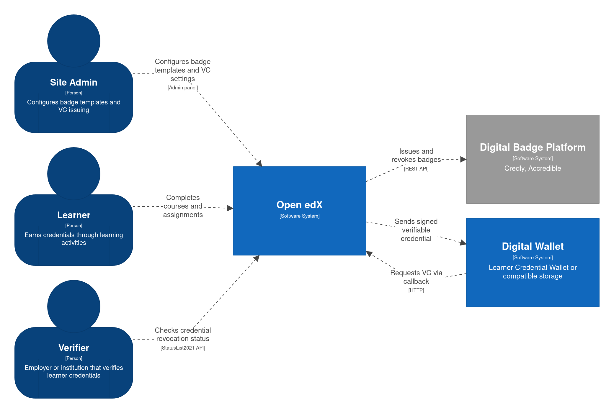
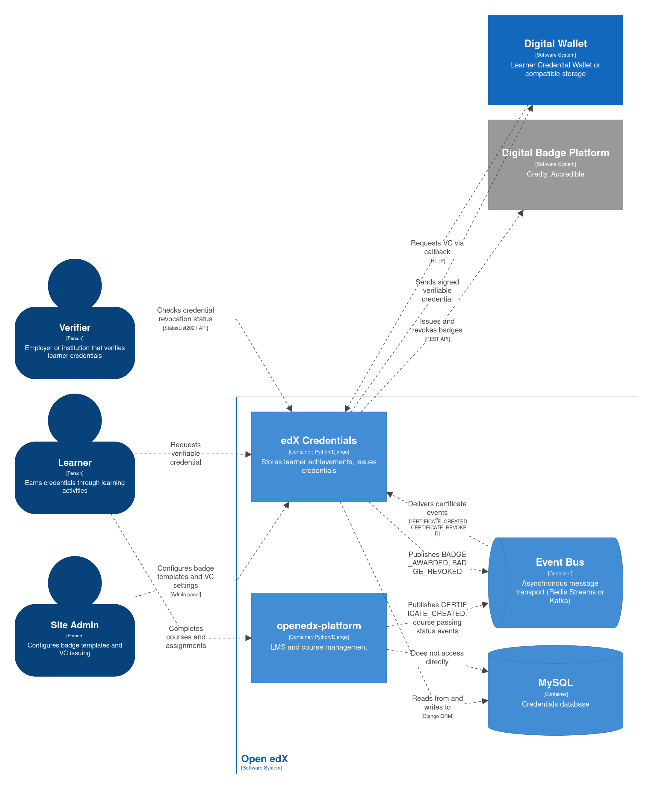

Verifiable Credentials
======================

Traditional certificates (PDFs, images) are easy to forge and hard to verify.
Employers and institutions that receive them must contact the issuing organization
to confirm authenticity - a slow, manual process that doesn't scale.

`Verifiable Credentials`_ (VCs) solve this problem. A VC is a digitally signed,
tamper-proof data object that any party can verify instantly, without contacting
the issuer. The `W3C Verifiable Credentials Data Model`_ and related
specifications define the standard.

Who Benefits
------------

- **Learners** receive portable, privacy-preserving proof of their achievements.
  They store VCs in a digital wallet and share them with anyone - employers,
  other institutions, professional networks - on their own terms.
- **Operators** (institutions, universities) issue VCs from their Open edX
  platform. The cryptographic signature ties each credential back to the issuer,
  strengthening the institution's brand and trust.
- **Relying parties** (employers, admissions offices) verify a credential in
  seconds. No phone calls, no email chains - just a standard verification check
  against a public :ref:`Status List <vc-status-list-api>`.

Architecture
------------

Three roles interact with the credential sharing system: **Site Admins**
configure badge templates and VC issuing, **Learners** earn and request
credentials, and **Verifiers** (employers, institutions) check their validity.
Credentials flow to external Digital Wallets and Digital Badge Platforms.

Inside the platform, the openedx-platform (LMS) publishes certificate events
to the Event Bus, which routes them to the Credentials service for processing.
From there, badges are issued to external providers and verifiable credentials
are delivered to learner wallets.

How It Works in Open edX
------------------------

The Verifiable Credentials feature is optional. Once enabled, it extends the
Credentials service and Learner Record micro-frontend.

The typical flow looks like this.

#. A learner earns an Open edX credential (course or program certificate).
#. The learner visits the Learner Record page and requests a verifiable
   credential.
#. The platform signs the credential using the configured issuer's private key
   and uploads it to the learner's digital wallet.
#. The learner can now present the VC to any relying party.
#. The relying party verifies the signature and checks the issuer's public
   status list to confirm the credential is still valid (not expired or
   revoked).

Operator Experience
-------------------

Setting up VCs involves a few steps.

#. Enable the feature flag (``ENABLE_VERIFIABLE_CREDENTIALS``).
#. Generate issuer credentials (a decentralized identifier and private key).
#. Configure the issuer in the Credentials admin site.
#. Ensure the Status List API endpoint is publicly accessible.

See the :ref:`Quick Start <vc-quickstart>` guide for detailed instructions.

The feature supports multiple verifiable credential specifications
(Open Badges v3.0, v3.0.1, and the W3C VC Data Model v1.1) and multiple
digital wallet backends. Both can be extended through plugins - see
:ref:`vc-extensibility` for details.

----

.. toctree::
    :maxdepth: 1

    quickstart
    usage
    components
    configuration
    extensibility
    composition
    storages
    tech_details
    api_reference

.. _Verifiable Credentials: https://en.wikipedia.org/wiki/Verifiable_credentials
.. _W3C Verifiable Credentials Data Model: https://www.w3.org/TR/vc-data-model-1.1/
