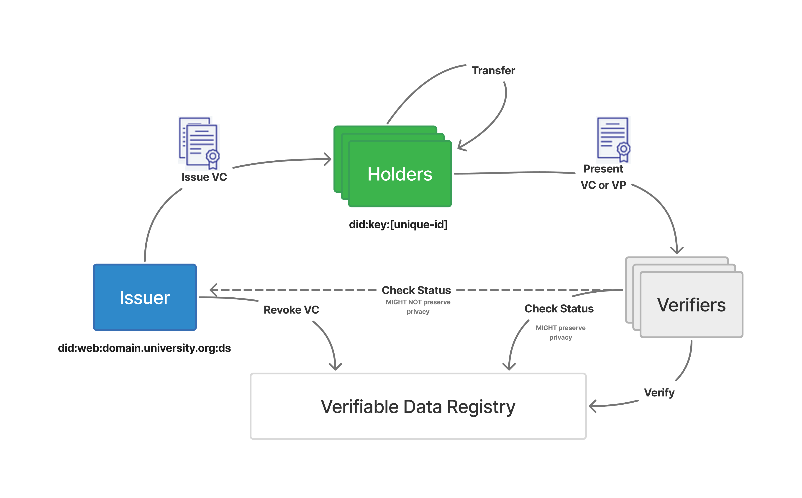

Verifiable Credentials
======================

Traditional certificates (PDFs, images) are easy to forge and hard to verify.
Employers and institutions that receive them must contact the issuing organization
to confirm authenticity - a slow, manual process that doesn't scale.

`Verifiable Credentials`_ (VCs) solve this problem. A VC is a digitally signed,
tamper-proof data object that any party can verify instantly, without contacting
the issuer. The `W3C Verifiable Credentials Data Model`_ and related
specifications define the standard.

Credentials ecosystem
---------------------

Three roles participate in the learner credentials ecosystem:

- **Learner** - holds portable, privacy-preserving proof of achievements
  in a digital wallet and shares them with employers, institutions, or
  professional networks.
- **Issuer** - creates and signs credentials. The cryptographic signature
  ties each credential back to the issuing organization, making
  authenticity independently verifiable.
- **Verifier** - validates a credential's signature and revocation status
  without contacting the issuer directly, using a public
  :ref:`Status List <vc-status-list-api>`.

Verifiable credentials lifecycle
--------------------------------

The W3C VC specification defines a standard lifecycle with three participants:

- **Issuer** (``did:web:domain.university.org``) - creates and signs
  verifiable credentials, can revoke them.
- **Holder** (``did:key:[unique-id]``) - receives, stores, and transfers
  VCs. Presents a VC or a Verifiable Presentation (VP) to verifiers.
- **Verifier** - checks the credential's signature and consults a
  Verifiable Data Registry (e.g. the issuer's Status List) to confirm the
  credential has not been revoked or expired.

Decentralized identifiers (DIDs)
~~~~~~~~~~~~~~~~~~~~~~~~~~~~~~~~~

Both issuers and holders are identified by
`Decentralized Identifiers (DIDs) <https://www.w3.org/TR/did-core/>`_.
A DID follows the format ``did:[method]:[unique-uri]``. Common methods include:

- ``did:key`` - self-contained, no external resolution needed. Used for learner (holder) identifiers.
- ``did:web`` - resolved via the issuer's domain over HTTPS. Used for institutional issuers.
- ``did:ethr`` - resolved via Ethereum blockchain.

A DID resolves to a **DID Document** containing the public key material needed to verify signatures.

How It Works in Open edX
------------------------

The Verifiable Credentials feature is optional. Once enabled, it extends the
Credentials service and Learner Record micro-frontend.

A single Open edX achievement can be used as a source for multiple verifiable
credentials, each using a different data model if needed. The typical flow
looks like this.

#. A learner earns an Open edX credential (course or program certificate).
#. The learner visits the Learner Record page and requests a verifiable
   credential. The platform generates a deep link or QR code.
#. The learner scans the QR code or follows the deep link to open their
   digital wallet app.
#. The digital wallet sends an issuance request back to the platform. The
   platform signs the credential using the configured issuer's private key
   and returns it to the wallet.
#. The learner can now present the VC to any relying party.
#. The relying party verifies the signature and checks the issuer's public
   status list to confirm the credential is still valid (not expired or
   revoked).

Setup
-----

Setting up VCs involves a few steps.

#. Enable the feature flag (``ENABLE_VERIFIABLE_CREDENTIALS``).
#. Generate issuer credentials (a decentralized identifier and private key).
#. Configure the issuer in the Credentials admin site.
#. Ensure the Status List API endpoint is publicly accessible.

See the :ref:`Quick Start <vc-quickstart>` guide for detailed instructions.

The feature supports multiple verifiable credential specifications
(Open Badges v3.0, v3.0.1, and the W3C VC Data Model v1.1) and multiple
digital wallet backends. Both can be extended through plugins - see
:ref:`vc-extensibility` for details.

----

.. toctree::
    :maxdepth: 1

    quickstart
    components
    configuration
    extensibility
    composition
    storages
    tech_details
    api_reference

.. _Verifiable Credentials: https://en.wikipedia.org/wiki/Verifiable_credentials
.. _W3C Verifiable Credentials Data Model: https://www.w3.org/TR/vc-data-model-1.1/
