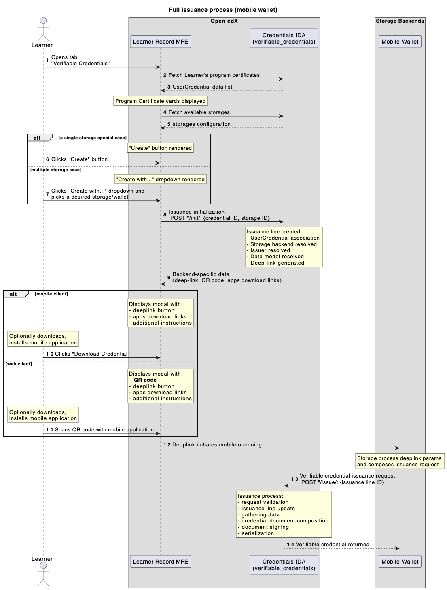

.. _vc-tech-details:

Implementation Details
======================

This section covers internal details that may help with debugging,
customization, or deeper understanding of the feature.

Prerequisites
-------------

The following conditions must be met before verifiable credentials can be
issued.

1. The ``verifiable_credentials`` app does not register its URL configuration
   or admin views until the main feature flag is enabled.
2. The default built-in configuration is almost self-contained - the only
   required step is to configure the Issuer's credentials (see
   :ref:`management command helper <vc-issuer-credentials-helper>`). If the
   Issuer is configured in the deployment environment from the start, those
   settings are used during the app data migration; otherwise, a manual
   Issuance Configuration edit is needed (Credentials admin site).
3. Multiple Issuance Configuration records can exist, but only the last
   enabled record is used.

Events flow
-----------

The following diagram illustrates the end-to-end issuance sequence.

- 1 - Learner navigates to the Learner Record MFE, enters the Verifiable Credentials page.
- 2,3 - Frontend fetches all Learner's credentials (program certificates).
- 4,5 - Frontend fetches configured storages list.
- Learner chooses their credential (program certificate) to issue verifiable credential for.
- 6,7 - Learner initiates an issuance (standard case: single storage, experimental case: many storages).
- 8 - Issuance Line is created with given context (storage + program certificate).
- 9 - all pre-requisites are evaluated and deep-link/QR code generated.
- Learner sees a modal dialog with deep-link/QR code to proceed with a mobile wallet app.
- 10,11 - Learner interacts with a dialog data (clicks/scans).
- 12 - Learner navigates to a mobile wallet app.
- 13 - mobile wallet app requests verifiable credential from an issuance API endpoint (on behalf of a Learner).
- verifiable_credentials application processes Issuance Line data (collects required data, composes it into a desired shape, evaluates status list data, adds signature).
- 14 - well-formed verifiable credential returned to a mobile wallet app.
- Mobile app verifies given verifiable credential (validates structure, signature, status info).

Credential signing
------------------

All credentials are signed using the **Ed25519Signature2020** proof suite exclusively.

VP authentication
-----------------

The ``IssueCredentialView`` accepts dual authentication: standard JWT/Session auth **or** a Verifiable Presentation
with ``proofPurpose: "authentication"`` and a ``challenge`` matching the ``IssuanceLine.uuid``. The VP signature is
verified via ``didkit``.

Signal-based status sync
------------------------

When a ``UserCredential`` status changes (e.g. revocation), all related ``IssuanceLine`` records are automatically
updated via a Django ``post_save`` signal. This ensures verifiable credentials reflect the current status of the
underlying Open edX achievement. In the case of revocation, the updated status is reflected in the issuer's
:ref:`Status List <vc-status-list-api>`, allowing relying parties to detect revoked credentials during
verification.

Synchronous didkit operations
-----------------------------

All ``didkit`` cryptographic operations are async functions wrapped with ``async_to_sync``. Each issuance blocks a
Django worker thread during signing. Consider this when sizing your deployment for high-volume issuance.

Technology choices
------------------

openedx-didkit
~~~~~~~~~~~~~~

The cryptographic core is `openedx-didkit`_, a fork of the original `DidKit`_ library by SpruceID with added
Verifiable Credentials v2 support. It is Rust-based and integrated into Python via PyO3 bindings.

.. _openedx-didkit: https://github.com/openedx/openedx-didkit
.. _DidKit: https://github.com/spruceid/didkit

Status List 2021
~~~~~~~~~~~~~~~~

Revocation tracking uses the `Status List 2021`_ specification - a simple bitstring where each issued
credential occupies one bit position. This approach was chosen over blockchain-based solutions for its
simplicity and because the status list is served as a standard API endpoint from the Credentials service
(see :ref:`vc-status-list-api`).

.. _Status List 2021: https://www.w3.org/TR/2023/WD-vc-status-list-20230427/

OpenBadges v3.0
~~~~~~~~~~~~~~~

The default data model is `Open Badges v3.0`_, a specification designed specifically for educational
achievements. It aligns with both VC Data Model v1.1 and v2.0, making credentials interoperable with
the broader verifiable credentials ecosystem while retaining education-specific semantics (achievements,
criteria, evidence).

.. _Open Badges v3.0: https://www.imsglobal.org/spec/ob/v3p0/

