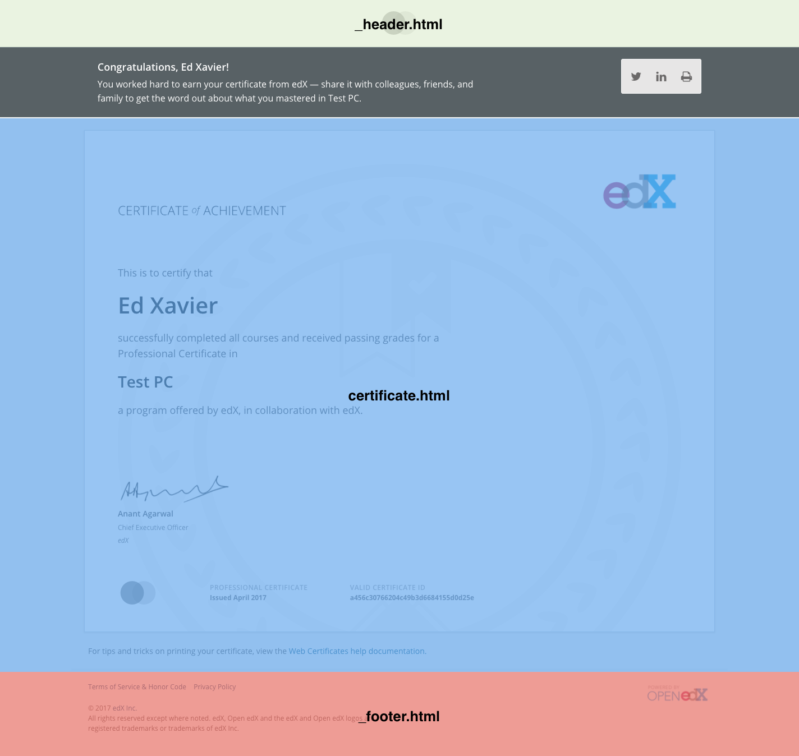

Theming
=======

The base certificate template is divided into three customizable sections:

* Header
* Certificate
* Footer

These sections can be customized by creating a theme, and associating that theme with a site/tenant. A theme is simply a
Django app with an assortment of templates. The Open EdX theme (``credentials_theme_openedx``) is included in this
repository as an example.

Installing a Theme
------------------
Follow the steps below to add a new theme.

1. Install the package into your Python environment (as you would any Django app). If you have setup the app locally, as
   is the case with ``credentials_theme_openedx`` or if you have forked the repo, you are all set.
2. Add the app to the ``INSTALLED_APPS`` setting.
3. Associate the theme with your site by setting the **Theme Name** value at ``/admin/core/siteconfiguration/`` in
   Django admin.
4. Test the setup by rendering the example credential at ``/credentials/example/``. Remember to test all of your program
   types by setting the ``program_type`` parameter to the slugified program type (e.g. "professional-certificate"
   instead of "Professional Certificate").

Creating a Theme
----------------
.. Generate this with tree (http://mama.indstate.edu/users/ice/tree/), which is available via Homebrew.
.. code-block:: text

    ../credentials/apps/credentials_theme_openedx/
    ├── __init__.py
    ├── locale
    |   ├── en
    │   |   └── LC_MESSAGES
    │   |       └── django.mo
    │   └── es_419
    │       └── LC_MESSAGES
    │           └── django.mo
    ├── static
    │   └── openedx
    │       └── openedx-logo.png
    └── templates
        └── openedx
            ├── _footer.html
            ├── _header.html
            ├── credentials
            │   ├── courses
            │   │   ├── edx+demox
            │   │   │   ├── 4t2017
            │   │   │   │   └── verified
            │   │   │   │       └── certificate.html
            │   │   │   └── certificate.html
            │   │   └── verified
            │   │       └── certificate.html
            │   └── programs
            │       ├── ff51584d-32fa-44b6-b8bb-63a8e55f963a
            │       │   └── certificate.html
            │       └── professional-certificate
            │           └── certificate.html
            └── images
                ├── example-logo.svg
                └── example-watermark.svg

The tree structure above shows the Open EdX theme with overrides for courses and programs.

There are a few notes that theme creators should keep in mind:

1. All directory names, except ``LC_MESSAGES``, should be lowercase to avoid issues that might occur when you are
   developing on case-insensitive environments (e.g. macOS) and deploying to case-sensitive environments (e.g. Linux).
   The ``LC_MESSAGES`` directory is an exception to this rule, as Django convention requires it to be all uppercase.
   See `How Django discovers translations`_ for more information.
2. The rendering view is specifically looking for files named `certificate.html`, `_footer.html`, and `_header.html`.
   If you use different file names for these components, they *will not* be rendered.
3. Feel free to import your custom CSS in `certificate.html`.
4. All theme-related static files and templates should be nested inside a directory with the theme's name (e.g.
   openedx). This will help avoid conflicts with the base templates and, potentially, other apps.
5. Course directories follow the format of {org}+{course}.
6. The `images` directory nested inside `templates` is not a mistake. SVG images can be styled with CSS. This is more
   easily accomplished if the image is inserted via Django's ```` tag rather than loaded as a static file.

Program certificates can be overridden at the following levels:

* Program type
* Individual program (based on UUID)

.. warning::

    Course certificates have not yet been implemented.

Course certificates can be overridden at the following levels:

* Seat type (e.g. honor, professional, verified)
* Course (e.g. edX+DemoX)
* Course run (e.g. course-v1:edX+DemoX+4T2017) + seat type

Records Theming
---------------
The records list and program record pages show customizable icons for each program type. By default, no icons will appear, unless a theme has the appropriate templates.

The templates for these two pages contain React factory calls which render the content onto the page. In order to add icons to the page, an ``icon`` parameter must be passed into the factory call, which is a dictionary mapping each slugifed program type to its icon. The base template factory calls do no have this parameter, but if a theme template exists, it will get included instead of using the base factory call.

These themed templates can be created by first copying the records_factory block from the `records template`_ and the program_record_factory block from the `programs template`_. Paste this code into new files in your theme's templates directory, at credentials/records.html and credentials/programs.html, respectively. In these new files, add in the ``icons`` parameter as seen in the example credentials/records.html below.

.. _records template: https://github.com/edx/credentials/blob/master/credentials/templates/records.html
.. _programs template: https://github.com/edx/credentials/blob/master/credentials/templates/programs.html
.. code-block:: JSX

    
      
    

The key for each icon should be the slugified program type, with underscores replacing hyphens.

The value should be the SVG, inline. To do this, you must include the SVG as a template, and with whitespace removed.

Note that this implementation creates a dependency in which any updates to the base factory calls must be copied over to the theme's factory calls, if the changes are desired to be seen there.

Internationalization
~~~~~~~~~~~~~~~~~~~~
Strings that appear in overridden files can be marked for translation by wrapping them in Django translation functions.
Refer to the `Django internationalization documentation`_ for more details.

Translations for custom strings can be provided by including a top level directory named ``locale`` within the theme
application. The ``locale`` directory should contain the compiled translation (.mo) files (produced by running the
``make compile_translations`` command), and should be structured according to the conventions described in `How
Django discovers translations`_. The directory tree example provided above in the `Creating a Theme`_ section includes
a properly structured ``locale`` directory.

Translations included with the theme application are available to the including application by default. Any conflicts
between translations provided by the theme application and the including application are resolved according to the
precedence rules described in `How Django discovers translations`_.

For more information on translations, look at the Internationalization_ documentation.

.. _Django internationalization documentation: https://docs.djangoproject.com/en/1.11/topics/i18n/translation/#internationalization-in-template-code
.. _How Django discovers translations: https://docs.djangoproject.com/en/1.11/topics/i18n/translation/#how-django-discovers-translations
.. _Internationalization: https://edx-credentials.readthedocs.io/en/latest/internationalization.html
