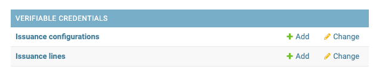
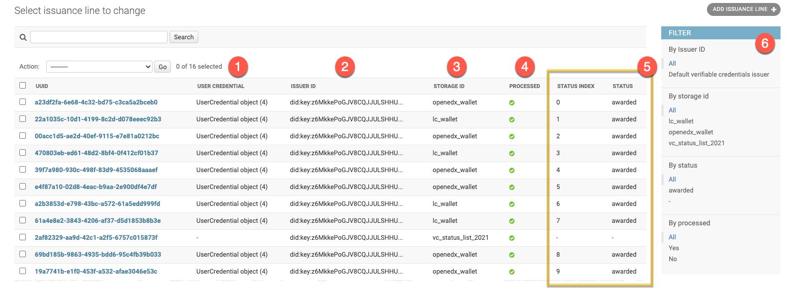
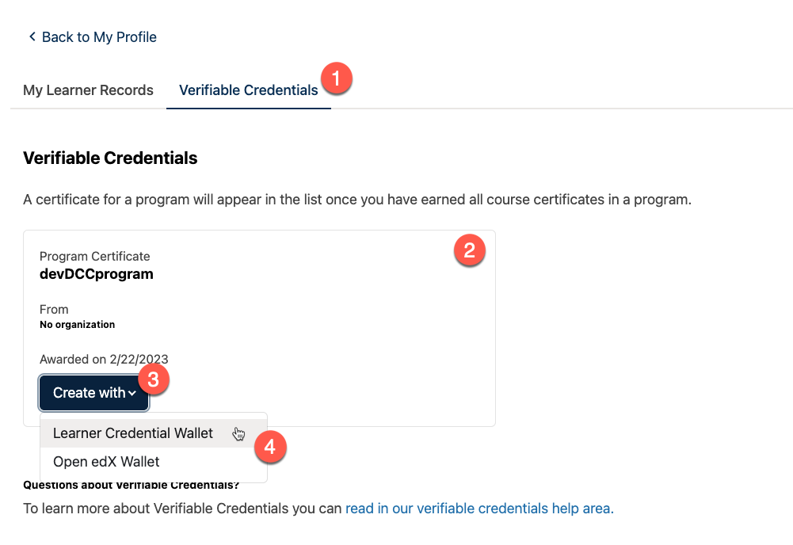

Components
==========

The Verifiable Credentials feature includes the following parts:

- **Verifiable Credentials application** (`credentials.apps.verifiable_credentials` within the Open edX Credentials IDA);
- **Learner Record MFE** (`frontend-app-learner-record` micro-frontend);
- third-party plugins (see `Extensibility`_)
- digital wallets (see `Storages`_)

Verifiable Credentials application
----------------------------------

The core backend logic and all related API are encapsulated in the `Verifiable Credentials application`_.

Once the Verifiable Credentials feature `is enabled <configuration.html>`__:

1. Admin site "Verifiable Credentials" section becomes available in the Credentials IDA.
2. Extra urls become available in the Credentials IDA.
3. Extra API endpoints become available within the Credentials IDA.

Administration site
~~~~~~~~~~~~~~~~~~~

Application section includes:

- a list of available issuers
- a list of initiated issuance lines

Currently, only a single Issuer configuration can be active in a moment of time:

.. image:: ../_static/images/verifiable_credentials-issuer-configuration.png
        :alt: Issuance Configurations

Issuance configuration describes an Issuer - Organization/University/School on behalf of which verifiable credentials are created. Issuer's ID becomes a part of a verifiable credential and a cryptographic proof is generated with the help of Issuer's private key. Each Issuer has a verbose name. It can be deactivated (checkbox).

.. note::
    Private key itself is a secret that is generated with the help of a cryptographic software.
    Issuer ID must be a `decentralized identifier`_ created based on a private key.

Issuance Line
    Each request for a verifiable credential issuance initiates a separate Issuance Line. It tracks verifiable credential processing life cycle and keeps a connection with a source Open edX user achievement.

Issuance line has its unique identifier and additionally includes this information:

1. **User Credential** - related Open edX achievement (e.g. "Program Certificate")
2. **Issuer ID** - issuer's which signs this verifiable credential
3. **Storage ID** - a storage backend (digital wallet) which will keep a verifiable credential
4. **Processing status** - if a verifiable credential was successfully uploaded to storage
5. **Status list info** - indicates if a verifiable credential still valid and unique status index within an Issuer's status list

Learner Record Microfrontend
-----------------------------

The Verifiable Credentials feature extends the `Learner Record MFE`_ with additional UI. An extra "Verifiable Credentials" page (tab) becomes available.

1. Once the Verifiable Credentials feature `is enabled <configuration.html>`__ tabs navigation appears
2. All learner's Open edX credentials are listed within the page
3. Achievement card has an action button that allows verifiable credential requesting based on the corresponding Open edX credential
4. Storages options (experimental)

.. note::
    Currently, a single (built-in) storage backend is implemented out of the box (`Learner Credential Wallet`_). In this case the only storage option is available by default, so "Create" action button won't have a dropdown. Additional storages appear under the "Create with" dropdown automatically once configured.

Status List API
---------------

There are a plenty of reasons verifiable credential may be already invalid, inactive or disposed:

- revocation
- implicit expiration
- a lot of other purposes

Open edX maintains status for internal credentials ("awarded", "revoked").

.. note::
    Once a Program Certificate X is revoked - **all** verifiable credentials which were issued based on that achievement must become revoked as well.

Public Status List API allows instant verifiable credentials checks. Each issuer maintains its own statuses sequence. Every issued verifiable credential takes a unique position in that sequence.

.. code-block:: sh

    # Status List API endpoint:
    GET <credentials-ida-host>/verifiable_credentials/api/v1/status-list/2021/v1/<issuer-id>/

    # Example:
    https://credentials.example.com/verifiable_credentials/api/v1/status-list/2021/v1/did:key:z6MkkePoGJV8CQJJULSHHUEv71okD9PsrqXnZpNQuoUfb3id/

A full set of status-related information is baked into a verifiable credential:

- where to find status list API endpoint
- what's the exact status position in a sequence

.. note::
    See Status List v2021 approach `Privacy Considerations`_

Status List example
~~~~~~~~~~~~~~~~~~~

Status List itself is a verifiable credential. But it serves a different purpose.

.. code-block:: sh

    # specific Issuer's status list:

    {
    "@context": [
        "https://www.w3.org/2018/credentials/v1",
        "https://w3id.org/security/suites/ed25519-2020/v1",
        "https://w3id.org/vc/status-list/2021/v1"
    ],
    "id": "https://credentials.example.com/verifiable_credentials/api/v1/status-list/2021/v1/did:key:z6MkkePoGJV8CQJJULSHHUEv71okD9PsrqXnZpNQuoUfb3id/",
    "type": [
        "VerifiableCredential",
        "StatusList2021Credential"
    ],
    "credentialSubject": {
        "id": "https://credentials.example.com/verifiable_credentials/api/v1/status-list/2021/v1/did:key:z6MkkePoGJV8CQJJULSHHUEv71okD9PsrqXnZpNQuoUfb3id/#list",
        "type": "StatusList2021",
        "encodedList": "H4sIAJzSq2QC/+3BAQ0AAADCoPdPbQ43oAAAAAAAAAAAAODfAC7KO00QJwAA",
        "statusPurpose": "revocation"
    },
    "issuer": {
        "id": "did:key:z6MkkePoGJV8CQJJULSHHUEv71okD9PsrqXnZpNQuoUfb3id"
    },
    "issuanceDate": "2023-05-16T20:33:39Z",
    "proof": {
        "type": "Ed25519Signature2020",
        "proofPurpose": "assertionMethod",
        "proofValue": "z2qgpEUHecAxtRNuRXqPavaLwq2cfTzLSykFa8FPEVxvuPxBkfHdqo17XTpA2q9wR7CYwBjsfDBXT2amXAZbRqdPz",
        "verificationMethod": "did:key:z6MkkePoGJV8CQJJULSHHUEv71okD9PsrqXnZpNQuoUfb3id#z6MkkePoGJV8CQJJULSHHUEv71okD9PsrqXnZpNQuoUfb3id",
        "created": "2023-07-10T09:42:52.259Z"
    },
    "issued": "2023-05-16T20:33:39Z",
    "validFrom": "2023-05-16T20:33:39Z"
    }

Status Entry example
~~~~~~~~~~~~~~~~~~~~

Every verifiable credential carries its status list "registration" info.

.. code-block:: sh

    # specific verifiable credential status section:

    "credentialStatus": {
        "id": "https://credentials.example.com/verifiable_credentials/api/v1/status-list/2021/v1/did:key:z6MkkePoGJV8CQJJULSHHUEv71okD9PsrqXnZpNQuoUfb3id/#15",
        "type": "StatusList2021Entry",
        "statusListCredential": "https://credentials.example.com/verifiable_credentials/api/v1/status-list/2021/v1/did:key:z6MkkePoGJV8CQJJULSHHUEv71okD9PsrqXnZpNQuoUfb3id/",
        "statusPurpose": "revocation",
        "statusListIndex": "15"
    },

Also see related `management command`_

.. _Verifiable Credentials application: https://github.com/openedx/credentials/tree/master/credentials/apps/verifiable_credentials
.. _Learner Record MFE: https://github.com/openedx/frontend-app-learner-record
.. _Extensibility: extensibility.html
.. _decentralized identifier: https://en.wikipedia.org/wiki/Decentralized_identifier
.. _Learner Credential Wallet: https://lcw.app/
.. _Privacy Considerations: https://w3c.github.io/vc-status-list-2021/#privacy-considerations
.. _management command: configuration.html#status-list-helper
.. _storages: storages.html