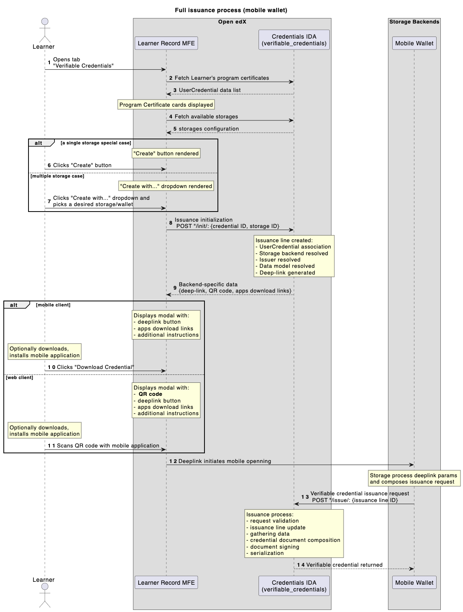

Implementation Details
======================

The following may clarify implicit internal details.

Prerequisites
-------------

Required initial activities.

1. Before the main feature flag (settings) is enabled the verifiable_credentials app won't register its urlconf, admin.
2. Default built-in configuration is almost self-contained - the only required step is to configure Issuer's credentials (see `management command helper`_). If Issuer is configured in deployment environment from the start, those settings are used during the app data migration, otherwise manual Issuance Configuration edit is needed (Credentials admin site).
3. There can be a list of Issuance Configuration records, but only the last enabled is taken into account in current implementation.

Events flow
-----------

Here is how everything happens.

- 1 - Learner navigates to the Learner Record MFE, enters the Verifiable Credentials page.
- 2,3 - Frontend fetches all Learner's credentials (program certificates).
- 4,5 - Frontend fetches configured storages list.
- Learner chooses theirs credential (program certificate) to issue verifiable credential for.
- 6,7 - Learner initiates an issuance (standard case: single storage, experimental case: many storages).
- 8 - Issuance Line is created with given context (storage + program certificate).
- 9 - all pre-requisites are evaluated and deep-link/QR-code generated.
- Learner is present modal dialog with deep-link/QR-code to proceed with a mobile wallet app.
- 10,11 - Learner interacts with a dialog data (clicks/scans).
- 12 - Learner navigates to a mobile wallet app.
- 13 - mobile wallet app requests verifiable credential from an issuance API endpoint (on behalf of a Learner).
- verifiable_credentials application processes Issuance Line data (collects required data, composes it into a desired shape, evaluates status list data, adds signature).
- 14 - well-formed verifiable credential returned to a mobile wallet app.
- Mobile app verifies given verifiable credential (validates structure, signature, status info).

New dependencies
----------------

Verifiable Credentials feature has introduced a couple of extra packages.

didkit-python
~~~~~~~~~~~~~

``didkit==0.3.3``

A tool for verifiable credentials operations (issuance, verification, signing, validation).

qrcode
~~~~~~

``qrcode==7.4.2``

We generate mobile deep-link QR-codes on a backend.

.. _management command helper: configuration.html#issuer-credentials-helper
